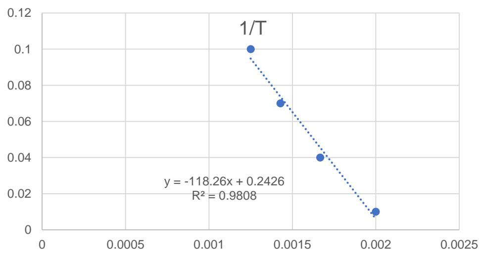
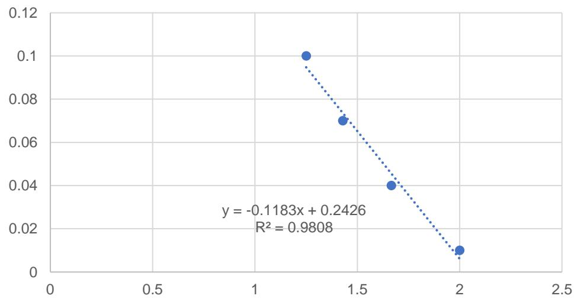

# CME 222 MASS TRANSFER

# Diffusive Mass Transfer

Dr. Tan Peng Chee

A4 #407

pengchee.tan@xmu.edu.my

# Table of Content

• Estimation of Diffusion Coefficient (Liquid, Solid, Pore Diffusivity)

# Estimation of Diffusion Coefficient (Liquid Diffusivity)

# Liquid Mass Diffusivity

• Theory of diffusion is not as advanced, less experimental data   
• Diffusivities in liquids are 4-5 order of magnitude smaller than gases   
• Can diffuse as molecules or ions (Ex: NaCl)

# Liquid Mass Diffusivity

# Eyring “hole” Theory

• The liquid is treated as quasi-crystalline lattice model interspersed with holes   
• The transport involves the jumping of solute molecules into the holes within the lattice model

# Liquid Mass Diffusivity

# Hydrodynamical Theory

• Liquid diffusion coefficient is related to solute molecules’ mobility   
• Depends on the velocity of molecules under the influence of a unit driving force   
• Provide relation between force and velocity   
• Stokes-Einstein Equation: considering the drag on a sphere moving in a continuous fluid

# Liquid Mass Diffusivity

# Stokes-Einstein Equation

• Describe the diffusion of colloidal particles or large round molecules through a solvent that behaves as a continuum relative to diffusing species

$$
D _ {A B} = \frac {k T}{6 \pi r \mu_ {B}}
$$

where:

$$
D _ {A B} = \text {D i f f u s i v i t y o f A i n d i l u t e s o l u t i o n B (m} ^ {2} / \mathrm {s})
$$

$$
\kappa = \mathrm {B o l t z m a n n c o n s t a n t} (1. 3 8 \times 1 0 ^ {- 2 3} \mathrm {J / K}),
$$

$$
T = \mathrm {A b s o l u t e t e m p e r a t u r e} (\mathsf {K}),
$$

$$
r = \mathrm {S o l u t e p a r t i c l e s r a d i u s} (\mathfrak {m}),
$$

$$
\mu_ {B} = \mathrm {S o l v e n t v i s c o s i t y (k g / m . s)}.
$$

# Liquid Mass Diffusivity

# Wilke-Chang Equation

• For nonelectrolytes in an infinitely dilute solution   
• For solute of small to moderate molecular weight (< 400)

$$
D _ {A B} = \frac {7 . 4 \times 1 0 ^ {- 8} T (\Phi_ {B} M _ {B}) ^ {\frac {1}{2}}}{V _ {A} ^ {0 . 6} \mu_ {B}}
$$

where:

$$
D _ {A B} = \text {D i f f u s i v i t y o f A t h r o u g h l i q u i d s o l v e n t B (c m} ^ {2} / \mathrm {s})
$$

$$
M _ {B} = \mathrm {M o l e c u l a r w e i g h t o f s o l v e n t (g / m o l)},
$$

$$
T = \mathrm {A b s o l u t e t e m p e r a t u r e} (\mathsf {K}),
$$

$$
V _ {A} = M o l e c u l a r v o l u m e o f s o l u t e a t n o r m a l b o i l i n g p o i n t (c m ^ {3} / m o l)
$$

$$
\mu_ {B} = \text {V i s c o s i t y o f s o l u t i o n (c P)}
$$

$$
\Phi_ {B} = \mathrm {A s s o c i a t i o n p a r a m e t e r f o r s o l v e n t B}
$$

# Liquid Mass Diffusivity

Table 24.4 Molecular volumes at normal boiling point for some commonly encountered compounds   

<table><tr><td>Compound</td><td>Molecular volume, 
in cm3/g mol</td><td>Compound</td><td>Molecular volume, 
in cm3/g mol</td></tr><tr><td>Hydrogen, H2</td><td>14.3</td><td>Nitric oxide, NO</td><td>23.6</td></tr><tr><td>Oxygen, O2</td><td>25.6</td><td>Nitrous oxide, N2O</td><td>36.4</td></tr><tr><td>Nitrogen, N2</td><td>31.2</td><td>Ammonia, NH3</td><td>25.8</td></tr><tr><td>Air</td><td>29.9</td><td>Water, H2O</td><td>18.9</td></tr><tr><td>Carbon monoxide, CO</td><td>30.7</td><td>Hydrogen sulfide, H2S</td><td>32.9</td></tr><tr><td>Carbon dioxide, CO2</td><td>34.0</td><td>Bromine, Br2</td><td>53.2</td></tr><tr><td>Carbonyl sulfide, COS</td><td>51.5</td><td>Chlorine, Cl2</td><td>48.4</td></tr><tr><td>Sulfur dioxide, SO2</td><td>44.8</td><td>Iodine, I2</td><td>71.5</td></tr></table>

# Liquid Mass Diffusivity

Table 24.5Atomic volumes for complex molecular volumes for simple substancest   

<table><tr><td>Element</td><td>Atomic volume, in cm3/g mol</td><td>Element</td><td>Atomic volume, in cm3/g mol</td></tr><tr><td>Bromine</td><td>27.0</td><td>Oxygen, except as noted below</td><td>7.4</td></tr><tr><td>Carbon</td><td>14.8</td><td>Oxygen, in methyl esters</td><td>9.1</td></tr><tr><td>Chlorine</td><td>21.6</td><td>Oxygen, in methyl ethers</td><td>9.9</td></tr><tr><td>Hydrogen</td><td>3.7</td><td>Oxygen, in higher ethers</td><td></td></tr><tr><td>Iodine</td><td>37.0</td><td>and other esters</td><td>11.0</td></tr><tr><td>Nitrogen, double bond</td><td>15.6</td><td>Oxygen, in acids</td><td>12.0</td></tr><tr><td>Nitrogen, in primary amines</td><td>10.5</td><td>Sulfur</td><td>25.6</td></tr><tr><td>Nitrogen, in secondary amines</td><td>12.0</td><td></td><td></td></tr></table>

# Liquid Mass Diffusivity

Volume Correction

<table><tr><td>Ring</td><td>Correction</td></tr><tr><td>Three-membered ring, as ethylene oxide</td><td>Deduct 6</td></tr><tr><td>Four-membered ring, as cyclobutane</td><td>Deduct 8.5</td></tr><tr><td>Five-membered ring, as furan</td><td>Deduct 11.5</td></tr><tr><td>Pyridine</td><td>Deduct 15</td></tr><tr><td>Benzene ring</td><td>Deduct 15</td></tr><tr><td>Naphthalene ring</td><td>Deduct 30</td></tr><tr><td>Anthracene ring</td><td>Deduct 47.5</td></tr></table>

# Liquid Mass Diffusivity

Estimation of VA

$$
V _ {A} = 0. 2 8 5 V _ {c} ^ {1. 0 4 8}
$$

???? = critical volume of species A (cm3/mol)

# Liquid Mass Diffusivity

Association Parameter   

<table><tr><td>Solvent</td><td>ΦB</td></tr><tr><td>Water</td><td>2.26</td></tr><tr><td>Methanol</td><td>1.9</td></tr><tr><td>Ethanol</td><td>1.5</td></tr><tr><td>Benzene, ether, heptane, and other unassociated solvents</td><td>1.0</td></tr></table>

# Example 1

Estimate the liquid diffusion coefficient of ethanol in a dilute solution of water at 10 oC. Given that the solution viscosity is 1.45 cP.

# Liquid Mass Diffusivity

# Kayduk and Laudie Equation

• For infinite dilution diffusion coefficients of nonelectrolytes in water

$$
D _ {A B} = 1 3. 2 6 \times 1 0 ^ {- 5} \mu_ {B} ^ {- 1. 1 4} V _ {A} ^ {- 0. 5 8 9}
$$

?????? = Mass diffusivity of A through liquid B, water (cm2/s)

$$
\mu_ {B} = \mathrm {V i s c o s i t y o f w a t e r (c P)}
$$

???? = Molecular volume of solute at normal boiling point (cm3/mol)

# Liquid Mass Diffusivity

# Scheibel Equation

Eliminate association factor in Wilke-Chang relation

$$
D _ {A B} = \frac {K T}{\mu_ {B} V _ {A} ^ {\frac {1}{3}}}
$$

$$
K = 8. 2 \times 1 0 ^ {- 8} \left[ 1 + \left(\frac {3 V _ {B}}{V _ {A}}\right) ^ {\frac {2}{3}} \right]
$$

# Except

1. For benzene as solvent, if $V _ { A } < 2 ~ V _ { B } , { \sf K } = 1 8 . 9 \times 1 0 ^ { - 8 }$ $V _ { A } < 2 ~ V _ { B }$   
2. For other organic solvent, if ???? < 2.5 ????, K = 17.5 × 10−8

# Example 2

Recalculate the diffusion coefficient of ethanol in dilute solution of water in Example 2 if the association parameter is not available.

# Liquid Mass Diffusivity

# Leffler and Cullinan Equation

• Predicting liquid diffusion coefficient in concentrated solution

$$
D _ {A B} \mu = (D _ {A B} ^ {o} \mu_ {B}) ^ {x _ {B}} (D _ {B A} ^ {o} \mu_ {A}) ^ {x _ {A}}
$$

???????? = Infinite dilution diffusion coefficient

????, ???? = Molar fraction of A and B in solution

# Liquid Mass Diffusivity

# Tyne Equation

• Extrapolate diffusivity at different temperature

$$
\boxed { \begin{array}{c} \frac {D _ {A B , T 1}}{D _ {A B , T 2}} = \left(\frac {T _ {c} - T _ {2}}{T _ {c} - T _ {1}}\right) ^ {n} \end{array} }
$$

T1 and T2 are in K

T is critical temperature of solvent B n is constant related to latent heat of vaporization of solvent at its normal boiling point temperature

<table><tr><td>ΔHv, (kJ/kmol)</td><td>7,900–30,000</td><td>30,000–39,000</td><td>39,000–46,000</td><td>46,000–50,000</td><td>&gt;50,000</td></tr><tr><td>n</td><td>3</td><td>4</td><td>6</td><td>8</td><td>10</td></tr></table>

# Example 3

Refer to the data in Appendix Table J2, estimate the diffusivity of acetic acid in water at 400 K and concentration of 0.01 mol/L. Heat of vaporization of water at normal boiling point (100oC, 1 atm) is 40656 J/mol; Critical temperature of water is 647.4K.

# Liquid Mass Diffusivity

# Nernst Equation

• Determine diffusion coefficient for dilute solution of completely ionized univalent electrolytes

$$
D _ {A B} = \frac {2 R T}{\left(\frac {1}{\lambda_ {+} ^ {0}} + \frac {1}{\lambda_ {-} ^ {0}}\right) F _ {a} ^ {2}}
$$

For univalent ions

?????? = Diffusion coefficient of A in B (cm2/s)

?? = Gas constant (8.314 J/K.mol)

T = Absolute temperature (K)

$\lambda _ { + } ^ { 0 } , \lambda _ { - } ^ { 0 } =$ Limiting ionic conductances (A/cm2)

???? = Faraday constant (96500 Coulombs/mol)

• For polyvalent salt: Replace the constant 2 by $( \textstyle { \frac { 1 } { n ^ { + } } } + { \frac { 1 } { n ^ { - } } } )$   
• $n ^ { + }$ and ??− are the valence of cation and anion

# Liquid Mass Diffusivity

Limiting Ionic Conductances In Water (25 oC)

<table><tr><td>Cation</td><td>λ0+</td><td>Anion</td><td>λ0-</td></tr><tr><td>H+</td><td>349.8</td><td>OH-</td><td>197.6</td></tr><tr><td>Li+</td><td>38.7</td><td>Cl-</td><td>76.3</td></tr><tr><td>Na+</td><td>50.1</td><td>Br-</td><td>78.3</td></tr><tr><td>K+</td><td>73.5</td><td>I-</td><td>76.8</td></tr><tr><td>NH4+</td><td>73.4</td><td>NO3-</td><td>71.4</td></tr></table>

# Estimation of Diffusion Coefficient (Solid Diffusivity)

# Solid Mass Diffusivity

• Solid diffusion is common in the synthesis of many engineering materials   
• Semiconductor: Dopants are introduced into solid silicon to control the conductivity   
• Steel: Hardening of steel due to diffusion of carbon and other elements through iron   
• Two common diffusion mechanism: vacancy diffusion, interstitial diffusion

# Vacancy Diffusion

• Atom “jumps” from a lattice position of solid into neighboring unoccupied lattice site/vacancy   
• Atom continues to diffuse through solid by a series of jumps   
• Atom must “push” other atoms to move from one site to another   
Requires energy   
Causes distortion of lattice   
• Diffusion rate depends on number of vacancy & activation energy to exchange

# Interstitial Diffusion

• Atom jumps from one interstitial site to a neighboring one   
• Involve dilation and distortion of lattice   
• Faster than vacancy diffusion because the diffusing atoms is usually smaller and there are more interstitial site than vacancy

site

# Solid Mass Diffusivity

• The diffusivity increases with increasing temperature according to Arrhenius equation

$$
D _ {A B} = D _ {o} e ^ {- Q / R T}
$$

$$
\ln (D _ {A B}) = - \frac {Q}{R} \frac {1}{T} + \ln (D _ {o})
$$

?????? = Solid diffusion coefficient of A within solid B

???? = Proportionality constant

Q = Activation energy (J/mol)

R = Gas constant (8.314 J/mol·K)

T = Absolute temperature (K)

# Solid Mass Diffusivity

Diffusion coefficients of substitutional dopants in crystalline silicon   
• Can determine Q and Do

  
1000/T

# Solid Mass Diffusivity

Table 24.6 Data for self-diffusion in pure metals   

<table><tr><td>Structure</td><td>Metal</td><td>Do(mm2/s)</td><td>Q(kJ/mole)</td></tr><tr><td>fcc</td><td>Au</td><td>10.7</td><td>176.9</td></tr><tr><td>fcc</td><td>Cu</td><td>31</td><td>200.3</td></tr><tr><td>fcc</td><td>Ni</td><td>190</td><td>279.7</td></tr><tr><td>fcc</td><td>Fe(γ)</td><td>49</td><td>284.1</td></tr><tr><td>bcc</td><td>Fe(α)</td><td>200</td><td>239.7</td></tr><tr><td>bcc</td><td>Fe(δ)</td><td>1980</td><td>238.5</td></tr></table>

  
Body-centered cubic

  
Face-centered cubic

# Solid Mass Diffusivity

Table 24.7Diffusion parameters for interstitial solutes in iron   

<table><tr><td>Structure</td><td>Solute</td><td>Do(mm2/s)</td><td>Q(kJ/mole)</td></tr><tr><td>bcc</td><td>C</td><td>2.0</td><td>84.1</td></tr><tr><td>bcc</td><td>N</td><td>0.3</td><td>76.1</td></tr><tr><td>bcc</td><td>H</td><td>0.1</td><td>13.4</td></tr><tr><td>fcc</td><td>C</td><td>2.5</td><td>144.2</td></tr></table>

# Estimation of Diffusion Coefficient (Pore Diffusivity)

# Knudsen Diffusion

• Diffusion of gas molecules through a very small capillary pores   
• Happen when the pore diameter is smaller than the mean free path of gas molecules and the density of gas is low   
• Gas molecules collide with the wall more frequently than with each other   
• Usually happen in gaseous phase diffusion (mean free path of liquid is small)   
Gas flux is reduced by wall collision

# Knudsen Diffusion

# Knudsen number

Measure of the relative important of Knudsen diffusion   
• If > 1, Knudsen diffusion is important

$$
K n = \frac {\lambda}{d _ {\text {p o r e}}} = \frac {\text {m e a n f r e e p a t h l e n g t h o f t h e d i f f u s i n g s p e c i e s}}{\text {p o r e d i a m e t e r}}
$$

• Knudsen number increase when pressure decrease and temperature increase

# Knudsen Diffusion

# Knudsen Diffusivity

Obtained from self-diffusion coefficient   
• Replace ?? with dpore as molecules is more likely to collide with pore wall

$$
D _ {A A ^ {*}} = \frac {\lambda u}{3} = \frac {\lambda}{3} \sqrt {\frac {8 \kappa N T}{\pi M _ {A}}} \quad \longrightarrow \quad D _ {K A} = \frac {d _ {\text {p o r e}}}{3} u = \frac {d _ {\text {p o r e}}}{3} \sqrt {\frac {8 \kappa N T}{\pi M _ {A}}}
$$

Substituting k = 1.38 x 10-16 gcm2/s2K and N = 6.02 x 1023 mol-1

$$
\boxed {D _ {K A} = 4 8 5 0 d _ {p o r e} \sqrt {\frac {T}{M _ {A}}}}
$$

$$
D _ {K A} = \mathrm {K n u d s e n d i f f u s i v i t y (c m ^ {2} / s)}
$$

$$
d _ {p o r e} = \mathrm {D i a m e t e r o f p o r e (c m)}
$$

$$
M _ {A} = \mathrm {M o l e c u l a r w e i g h t (g / m o l)}
$$

$$
T = \mathrm {T e m p e r a t u r e} (K)
$$

# Knudsen Diffusion + Molecular Diffusion

# Effective Diffusivity

$$
\frac {1}{D _ {A e}} = \frac {1 - \alpha y _ {A}}{D _ {A B}} + \frac {1}{D _ {K A}}
$$

$$
\alpha = 1 + \frac {N _ {B}}{N _ {A}}
$$

When ?? =0 (NA=-NB) or when yA is close to zero

$$
\frac {1}{D _ {A e}} = \frac {1}{D _ {A B}} + \frac {1}{D _ {K A}}
$$

Applied for straight, cylindrical pores aligned in parallel array

# Knudsen Diffusion + Molecular Diffusion

# Effective Diffusivity In Random Pores

• In most porous materials, pores of various diameter are twisted and interconnected   
Diffusion path is tortuous

$$
D _ {A e} ^ {\prime} = \varepsilon^ {2} D _ {A e}
$$

$$
\varepsilon = \frac {\text {V o l u m e o c c u p i e d b y p o r e s w i t h i n t h e p o r u s s o l i d}}{\text {T o t a l v o l u m e o f p o r u s s o l i d (s o l i d + p o r e s)}}
$$

$$
\varepsilon = \mathrm {v o i d f r a c t i o n}
$$

# Types of Porous Diffusion

Pure molecular diffusion

Pore wall

$$
D _ {A B} = \frac {0 . 0 0 1 8 5 8 T ^ {3 / 2} \left[ \frac {I}{M _ {A}} + \frac {I}{M _ {B}} \right] ^ {1 / 2}}{P \sigma_ {A B} ^ {2} \Omega_ {D}}
$$

Pure knudsen diffusion

Pore wall

$$
D _ {K A} = \frac {d _ {p o r e}}{3} \sqrt {\frac {8 \kappa N T}{\pi M _ {A}}}
$$

Knudsen $^ +$ molecular diffusion

Pore wall

$$
\frac {I}{D _ {A e}} \cong \frac {I}{D _ {A B}} + \frac {I}{D _ {K A}}
$$

Random porous material

$$
D _ {A e} ^ {\prime} = \varepsilon^ {2} D _ {A e}
$$

# Example 4

One step in the manufacture of optical fibers is the chemical vapor deposition of silane $\left( \mathsf { S i H } _ { 4 } \right)$ on the inside surface of a hollow glass fiber to form a very thin cladding of solid silicon by reaction:

$$
\mathrm {S i H} _ {4} (\mathsf {g}) \rightarrow \mathrm {S i} (\mathsf {s}) + 2 \mathrm {H} _ {2} (\mathsf {g})
$$

Typically, the process is carried out at high temperature and very low total system pressure. Optical fibers for high bandwidth data transmission have very small inner pore diameters, typically less than 20 µm. If the inner diameter of the Si-coated hollow glass fiber is 10 µm, assess the importance of Knudsen diffusion for $\mathsf { S i H } _ { 4 }$ inside the fiber lumen at 900 K and 100 Pa total system pressure. Calculate the effective diffusivity of silane in this system. Silane is diluted to 1 mol% in the inert carrier gas helium. The binary gas diffusivity of silane in helium at 25 oC and 1 atm total system pressure is 0.571 cm2/s, with ????????4 = 4.08 Å and $\begin{array} { r } { \frac { \varepsilon _ { S i H 4 } } { k } = 2 0 7 . 6 \mathsf { K } . } \end{array}$ .. The molecular weight of silane is 32 g/mol.

# Hindered Diffusion

• The diffusion of a solute molecule through a tiny capillary pore filled with liquid solvent   
As solute diameter approaches the diameter of pore, the diffusive transport of solute through the solvent is hindered by the presence of pore and pore wall

# Hindered Diffusion

# Effective Diffusion Coefficient

$$
D _ {A e} = D _ {A B} ^ {\circ} F _ {1} (\varphi) F _ {2} (\varphi)
$$

$D _ { A B } ^ { o } = \mathsf { D i }$ ffusion coefficient of solute A in solvent B at infinite dilution

??1 (??), ??2 (??) = correction factor (0 to 1)

# Reduced Pore Diameter

$$
\varphi = \frac {d _ {s}}{d _ {p o r e}} = \frac {\mathrm {s o l u t e m o l e c u l a r d i a m e t e r}}{\mathrm {p o r e d i a m e t e r}}
$$

• If $\varphi > 1$ , solute too large to enter pore (solute exclusion)   
Use to separate large biomolecules such as protein

# Hindered Diffusion

Stearic Partition Coefficient , $F _ { 1 } \left( \varphi \right)$

$$
F _ {1} (\varphi) = \frac {\text {f l u x a r e a a v a i l a b l e t o s o l u t e}}{\text {t o t a l f l u x a r e a}} = \frac {\pi \left(d _ {p o r e} - d _ {s}\right) ^ {2}}{\pi d _ {p o r e} ^ {2}} = (1 - \varphi) ^ {2}
$$

For 0 ≤ ??1 ?? ≤ 1

Hydrodynamic Hindrance Factor, $F _ { 2 } \left( \varphi \right)$

$$
F _ {2} (\varphi) = 1 - 2. 1 0 4 \varphi + 2. 0 9 \varphi^ {3} - 0. 9 5 \varphi^ {5}
$$

• Assume diffusion of rigid spherical solute in straight cylindrical pore   
Reasonable for $0 \le ( \varphi ) \le 0 . 6$

# Example 5

It is desired to separate a mixture of two industrial enzymes, lysozyme and catalase, in a dilute, aqueous solution (water solvent) by a gel filtration membrane. A mesoporous membrane with cylindrical pores of 30 nm diameter is available. The following separation factor $( \alpha )$ for the process is proposed

$$
\alpha = \frac {D _ {A e}}{D _ {B e}}
$$

Given that the molecular weight and diameter of lysozyme (species A) is 14100 g/mol and 4.12 nm. For catalase (species B), the molecular weight and diameter is 250000 g/mol and 10.44 nm respectively. Determine the separation factor for this process at 298K.

# Take Home Message

# Stokes-Einstein Equation

$$
D _ {A B} = \frac {k T}{6 \pi r \mu_ {B}}
$$

# Wilke-Chang Equation

$$
D _ {A B} = \frac {7 . 4 \times 1 0 ^ {- 8} T (\Phi_ {B} M _ {B}) ^ {\frac {1}{2}}}{V _ {A} ^ {0 . 6} \mu_ {B}}
$$

# Kayduk and Laudie Equation

$$
D _ {A B} = 1 3. 2 6 \times 1 0 ^ {- 5} \mu_ {B} ^ {- 1. 1 4} V _ {A} ^ {- 0. 5 8 9}
$$

For larger molecules, dilute

Nonelectrolyte, dilute, small to moderate size (Mw < 400)

Dilute nonelectrolyte in water

# Take Home Message

# Scheibel Equation

$$
D _ {A B} = \frac {K T}{\mu_ {B} V _ {A} ^ {\frac {1}{3}}}
$$

Eliminate association factor

# Leffler and Cullinan Equation

$$
D _ {A B} \mu = (D _ {A B} ^ {o} \mu_ {B}) ^ {x _ {B}} (D _ {B A} ^ {o} \mu_ {A}) ^ {x _ {A}}
$$

For concentrated solution

# Tyne Equation

$$
\frac {D _ {A B , T 1}}{D _ {A B , T 2}} = \left(\frac {T _ {c} - T _ {2}}{T _ {c} - T _ {1}}\right) ^ {n}
$$

Predict diffusivity at different temperature

# Take Home Message

Solid Diffusion

$$
D _ {A B} = D _ {o} e ^ {- \underline {{O}} / R T}
$$

Vacancy & Interstitial diffusion

Knudsen Diffusivity

$$
D _ {K A} = 4 8 5 0 d _ {p o r e} \sqrt {\frac {T}{M _ {A}}}
$$

Mean free path larger than pore size

# Take Home Message

Effective Diffusivity Equation

$$
\frac {1}{D _ {A e}} = \frac {1 - \alpha y _ {A}}{D _ {A B}} + \frac {1}{D _ {K A}}
$$

$$
\frac {1}{D _ {A e}} = \frac {1}{D _ {A B}} + \frac {1}{D _ {K A}}
$$

Effective Diffusivity In Random Pores

$$
D _ {A e} ^ {\prime} = \varepsilon^ {2} D _ {A e}
$$

Straight, cylindrical pore

Pore with tortuous path

# Take Home Message

Hindered Diffusion

$$
D _ {A e} = D _ {A B} ^ {\circ} F _ {1} (\varphi) F _ {2} (\varphi)
$$

Pore filled with solvent, more significant if the size of molecule approaching pore diameter