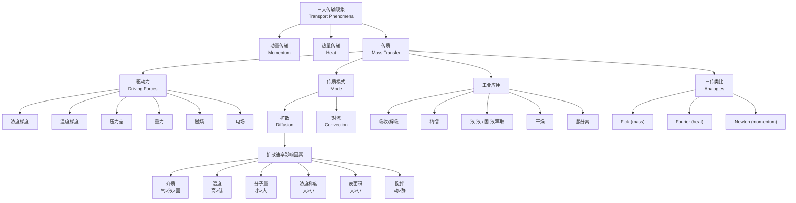

# 传质导论 / Introduction to Mass Transfer

> [!abstract] 本节定位
> - **在课程中的位置**: 第 1 周, L01（课程开门 + 概念铺垫）
> - **前置知识**: 物理化学基础（浓度、相、相平衡）、动量传递（流体力学）、热量传递（Fourier 定律）
> - **本节核心**: 把"传质"和动量、能量传递并列为三大 transport phenomena 之一；先认识它在哪里发生（**驱动力**和**两种模式**），再认识它由什么影响（**扩散速率因素**），最后看它在工业里长什么样（**吸收/精馏/萃取/干燥/膜分离**）。
> - **后续联系**: 后续会展开 [[Fick 定律]] 推导和扩散系数 $D$、传质系数 $k$ 的计算，以及双膜理论、对流传质边界层

---

## 课程行政信息（速览）

> [!info]- 课程基本信息
> - **教师**: Dr. Tan Peng Chee（A4 #407, pengchee.tan@xmu.edu.my）
> - **学分**: 3（2 h lecture + 2 h tutorial）
> - **上课时间**: Lecture 周三 1–3 pm；Tutorial 周四 1–3 pm（Group 1）/ 3–5 pm（Group 2）
> - **Moodle 注册码**: `CME222`
> - **Office hour**: 周二 10 am–12 pm 和 2 pm–4 pm
> - **主教材**: Welty, Rorrer, Foster (2019). *Fundamentals of Momentum, Heat and Mass Transfer*, 7th ed., Wiley.（PPT 红字标重点教材）
>
> **考核**: Assignment 25% + Test (Week 8) 25% + Final Exam 50%
> **过关**: Final Exam ≥ 40 **AND** Total ≥ 55
>
> **CLO 三条**：
> 1. 把传质基本知识用在实际问题
> 2. 区分传质机制 + 计算气/液/固的扩散系数
> 3. 分析单相和两相系统中的扩散过程，计算通量

> [!warning] 补课和测试时间
> - **27 May 2026 (Wk8 周三 10am–12pm)** → 移到 **29 May 2026 (Wk8 周五 2–4pm) — TEST**
> - 17 June 2026 (Wk11 周三 10am–12pm) → 移到 12 June 2026 (Wk10 周五 10am–12pm)

---

## 知识结构

---

## 知识块 1 — 什么是传质（Mass Transfer）

**[[传质]]** 定义：流体混合物中，**一种或多种组分**因某种**驱动力**而发生的传输。

> 简化版：浓度（或别的"势"）不均匀时，物质会自发运动让差异变小，这个过程就叫传质。

> [!tip] 延伸（非 PPT 内容）
> 注意"传质"严格说是**组分**层面的传递，不是整个流体的运动。整个流体一起流动属于"流动"或"对流"；只有当混合物里**某一组分相对于另一组分**有净位移时才叫传质。

### 六种驱动力（Driving Force）

| 驱动力 | 例子 | 工业应用 |
|---|---|---|
| **浓度梯度**（最常见） | 蒸发、染料在水里散开 | 吸收、萃取 |
| **温度梯度** | 铀同位素热扩散柱（轻 U-235 在热侧、重 U-238 在冷侧） | 同位素分离 |
| **压力差** | 反渗透膜分离 | 海水淡化、气体膜分离 |
| **重力（密度差）** | 分液漏斗（煤油 / 水）、离心分离 | 萃取分相、悬浮液分离 |
| **磁场** | 离子在磁场里偏转（质谱仪）；带电粒子被磁场约束 | 同位素分离（质谱式） |
| **电场** | 离子向反号电极迁移 | 氯碱电解 |

> [!tip] 延伸（非 PPT 内容）
> 大多数本科课程聚焦在**浓度梯度**这一种驱动力（Fick 扩散），其他驱动力在工程实践常常合在一起讨论或归入"耦合传输（coupled transport）"。考试和习题里 95% 是浓度梯度。

#### 例子：氯碱电解（Chlor-alkali）

电场驱动的工业例子。电解槽里：
- **阳极（A）**：26% NaCl 入料，Cl⁻ 被氧化成 Cl₂
- **选择性阳离子膜**：只让 Na⁺ 通过
- **阴极（C）**：H₂O 被还原成 OH⁻ + H₂；24% NaCl 出料；NaOH 产物出

总反应：

$$2\text{NaCl} + 2\text{H}_2\text{O} \rightarrow \text{Cl}_2 + \text{H}_2 + 2\text{NaOH}$$

> [!tip] 延伸（非 PPT 内容）
> 浓度从 26% → 24% 看起来变化不大，但工业规模下这点差值乘以巨大的料液流量就是 NaOH 产量。这是工业过程"用大流量+小转化率换稳定性"的典型例子。

---

## 知识块 2 — 传质的两大模式：扩散 vs 对流

> 这是**全课最关键的二分**。后面所有公式、所有应用都围绕这两个模式展开。

### 扩散（Diffusion）

**定义**：分子、离子或小颗粒**在浓度梯度作用下**，从高浓度区到低浓度区的传输。

关键性质：
- 没有浓度梯度时，分子仍然做随机的[[布朗运动]]（Brownian motion），但**没有净传质**，系统保持均匀
- 扩散方向**沿浓度递减方向**（数学上由 Fick 第一定律刻画）
- 达到平衡（浓度均匀）后扩散停止

> [!tip] 延伸（非 PPT 内容）
> "扩散停止"是宏观平均意义上停止 — 微观上分子还在乱跑，只是过截面的正反通量相等，**净通量为零**。这种"动态平衡"是后面学吸附、相平衡时反复出现的概念。

### 对流（Convection）

**定义**：流体运动 + 扩散**共同**作用，把组分从一个区域送到另一个区域。

关键点：
- 必须有**流体宏观运动**（流速 ≠ 0）
- **类比**对流换热：换热的 $h$ ↔ 传质的 $k$
- 影响因素是**流体动力学**特征（雷诺数、几何、表面粗糙度）

#### 同一杯糖水：扩散 vs 对流

不搅拌：糖块在杯底，靠分子扩散慢慢溶 → 几小时
搅拌：勺子搅出对流 → 几秒就溶完

这就是**对流速率 ≫ 扩散速率**最直观的例子。

---

## 知识块 3 — 扩散在固/液/气三态里有什么不同

| 状态 | 是否刚性 | 形状 | 体积 | 可压缩 |
|---|---|---|---|---|
| **固体（solid）** | 刚性 ✓ | 固定 | 固定 | ✗ 不可压 |
| **液体（liquid）** | 不刚性 | 不固定 | 固定 | ✗ 不可压 |
| **气体（gas）** | 不刚性 | 不固定 | 不固定 | ✓ **可压** |

**核心结论**：扩散速率 **气体 ≫ 液体 ≫ 固体**

直觉解释：
- **气体**：分子稀疏，平均自由程长，相互碰撞少，跑得快
- **液体**：分子紧密但能挪动，每跑一步就被"撞回来"，慢
- **固体**：分子被晶格束缚，只能通过空位扩散或晶界跳跃，最慢

> [!tip] 延伸（非 PPT 内容）
> 数量级：气体扩散系数 $D \sim 10^{-5}$ m²/s（如 CO₂ 在空气）；液体 $D \sim 10^{-9}$ m²/s（如盐在水里）；固体 $D$ 跨度极大，常温金属里 $D < 10^{-20}$ m²/s。这个**4–5 个数量级的差异**是后面做估算时的"重力"。

---

## 知识块 4 — 扩散速率的影响因素

按"快 → 慢"排列：

### (1) 介质（Medium）

$$\text{气体} > \text{液体} > \text{固体}$$

理由见知识块 3。

### (2) 温度（Temperature）

$$\text{高温} > \text{低温}$$

温度高 → 分子热运动剧烈 → 扩散快。后面学到的 Stokes-Einstein 关系 $D \propto T/\eta$（液体）和 Chapman-Enskog（气体）会量化这个。

### (3) 分子量 / 粒径（Molecular weight / Particle size）

$$\text{小分子} > \text{大分子}$$

#### 实验例证（PPT slide 34）

同一培养皿里三种染料同时滴入：

| 染料 | 分子量 (Da) | 扩散圈大小 |
|---|---|---|
| **高锰酸钾（KMnO₄）** | **158** | **最大**（最快） |
| 亚甲基蓝（Methylene Blue） | 320 | 中 |
| 番红（Safranin） | 350.84 | **最小**（最慢） |

> 一目了然：分子量越小，扩散越快。

> [!tip] 延伸（非 PPT 内容）
> 严格说扩散系数和**分子有效半径** $r$ 相关（Stokes-Einstein：$D = k_B T / (6\pi \eta r)$），不是直接和分子量。但分子越大通常半径越大、$D$ 越小，所以课本常用分子量当近似指标。蛋白质（>3,000,000 Da）扩散比小分子（44 Da）慢上千倍就是这个原因。

### (4) 浓度梯度（Concentration gradient）

$$\frac{dC}{dx} \text{ 大} \rightarrow \text{扩散通量大}$$

PPT 例子：
- 低梯度：左 10 / 右 4，差 6 → 通量小
- 高梯度：左 18 / 右 4，差 14 → 通量大（粗箭头）

这就是 **Fick 第一定律的雏形**：

$$J = -D \frac{dC}{dx}$$

负号表示通量方向沿浓度**降低**方向。

### (5) 表面积（Surface area）

$$\text{大表面积} > \text{小表面积}$$

例：宽口烧杯比窄口烧杯蒸发快（蒸发面积大）。

> [!tip] 延伸（非 PPT 内容）
> 工业上**填料塔、喷淋塔、膜组件**全都是想方设法把传质面积做大 — 一根 1 米直径的塔里塞满拉西环填料，有效传质面积可能上千平方米。

### (6) 系统动力学（搅拌 vs 静态）

$$\text{动态（有流动）} > \text{静态}$$

→ **这一点直接引出对流**。搅拌产生宏观流动，把组分从扩散主导切到对流主导，速率提升数量级。

---

## 知识块 5 — 工业应用：传质长什么样

> 工业上几乎所有**分离过程**都靠传质。下面是六大类。

### (1) 气体吸收（Gas Absorption）/ 解吸（Stripping）

- **吸收**：用溶剂从气流里抓住目标组分。例：胺液吸收烟道气中的 CO₂、用水吸收 SO₂
- **解吸**：反向过程，把溶剂里的组分释放回气相，回收溶剂

> ![[CME 222 Lecture 1/images/b96fd3ef155defd7c516adf7c3ec8cc9ada82c88fbbe6cb8408bd35ede4c1001.jpg]]
> **胺法 CO₂ 捕集流程**：左侧 Absorber 用 lean amine 吸收烟气里的 CO₂；rich amine 进右侧 Stripper，靠 reboiler 加热释放 CO₂；中间 Cross Heat Exchanger 做热回收。出塔顶的 CO₂ 进压缩，amine 循环利用。

### (2) 精馏（Distillation）

各级塔板上，气液两相做传质 → 轻组分集中到塔顶、重组分集中到塔底。

> ![[CME 222 Lecture 1/images/d1ec72a55b7be5511e28b259af0e104c1266ad6c7b39f29da415399077ca9cee.jpg]]
> **典型精馏塔**：feed 进中部，回流（reflux）从冷凝器回到塔顶，再沸器（reboiler）从塔底加热产生上升蒸汽。塔顶出 distillate，塔底出 bottom。

### (3) 液-液萃取（Liquid-Liquid Extraction）

利用组分在两种**互不相溶**的溶剂里的**溶解度差**做分离。

例：
- 用丁基乙酸酯从发酵液萃取**青霉素**
- 用有机溶剂从水里萃取醋酸

两种接触方式：
- **并流（cocurrent）**：feed 和 solvent 同方向流，传质驱动力随接触递减
- **逆流（countercurrent）**：feed 和 solvent 反方向流，传质驱动力沿全程更均衡 → **效率高**

### (4) 固-液萃取（Solid-Liquid Extraction / Leaching）

用溶剂从固体里抽组分。
- 咖啡 / 茶叶里萃取咖啡因
- 大豆 / 棉籽 / 花生里用己烷（hexane）萃取油
- 矿石里用 NaCN 水溶液浸出黄金（金的氰化）

### (5) 干燥（Drying）

去除固体中的水分。
- 设备例子：rotary drum dryer（卧式滚筒）、flash dryer
- **直接型**：固体直接接触热气流；**间接型**：靠壁面传热

### (6) 膜分离（Membrane Separation）

> ![[CME 222 Lecture 1/images/aef812635a01a447bccdff70faf07cf40fc1bf212b3911c24f81c92ca5619dab.jpg]]
> Feed 流经选择性膜后分两股：被截留的 **retentate** 和透过的 **permeate**。

应用：
- **水分离**：从废水里去染料、油、重金属
- **气体分离**：CO₂ 脱除、沼气提质、H₂ 回收
- **其他**：果汁澄清、产物浓缩

---

## 知识块 6 — 三传类比（Mass / Heat / Momentum Analogies）

> **这是本节的"压轴 punchline"**：动量、热、传质三种传输虽然物理对象不同，但**数学形式完全一致** — 都是"通量 = 系数 × 势的梯度"。

### 三大守恒定律对照

| 传输现象 | 控制定律 | 驱动势 | 通量公式 |
|---|---|---|---|
| **传质（Mass）** | Fick 第一定律 | 浓度梯度 $dC_b/dx$ | $j = -D \dfrac{dC_b}{dx}$ |
| **热传递（Heat）** | Fourier 导热定律 | 温度梯度 $dT/dx$ | $q = -k \dfrac{dT}{dx}$ |
| **动量传递（Momentum）** | Newton 黏性定律 | 速度梯度 $du/dy$ | $\tau = -\mu \dfrac{du}{dy}$ |

> **解读**：三个公式形式完全平行 —— 都是"通量 = 负的（运输系数 × 势的梯度）"。负号代表通量方向沿势**降低**方向。$\tau$ 既是剪切应力，也是动量通量（这两个其实是同一个东西的两种说法）。

### 每种传输都由两部分组成

| 传输 | 分子层面 | 体积流动层面 |
|---|---|---|
| **Mass** | 扩散（Diffusion） | 对流（Convection） |
| **Heat** | 传导（Conduction） | 对流（Convection） |
| **Momentum** | 黏性（Viscous） | 对流（Convection） |

> [!tip] 延伸（非 PPT 内容）
> 这个类比的强大之处：**会做一种就会另两种**。学过传热的 Nusselt 数 $Nu = hL/k$ 后，传质里的 Sherwood 数 $Sh = kL/D$ 完全是同一形式；学过动量边界层后，浓度边界层和热边界层的厚度估算也都是平行的。后面学到 **Chilton-Colburn 类比**（$j_D = j_H = j_M$）会把这种平行关系变成可计算的关系。

---

## 对比与总结

### 扩散 vs 对流 速查

| 维度 | 扩散（Diffusion） | 对流（Convection） |
|---|---|---|
| 驱动力 | 浓度梯度 | 流体宏观运动 + 浓度梯度 |
| 流体是否运动 | 否（流体静止） | 是（必有流速） |
| 关键参数 | 扩散系数 $D$ | 传质系数 $k$ |
| 速率量级 | 慢（液体 $\sim 10^{-9}$ m²/s） | 比扩散快几个数量级 |
| 类比换热 | 类比导热 | 类比对流换热 |
| 典型场景 | 静止流体里的浓度均匀化 | 风吹蒸发、河里污染物扩散 |

### 三传定律速查（最重要的表）

| 量 | Mass | Heat | Momentum |
|---|---|---|---|
| 通量符号 | $j$ | $q$ | $\tau$ |
| 系数 | 扩散系数 $D$（m²/s） | 导热系数 $k$（W/(m·K)） | 黏度 $\mu$（Pa·s） |
| 梯度 | $dC/dx$ | $dT/dx$ | $du/dy$ |
| 公式 | $j=-D\,dC/dx$ | $q=-k\,dT/dx$ | $\tau=-\mu\,du/dy$ |

---

## 本节引入的核心概念

<!-- 这些是后续 lecture 要展开的概念，可以建独立笔记并 backlink -->

- [[传质 Mass Transfer]]
- [[扩散 Diffusion]]
- [[对流传质 Convective Mass Transfer]]
- [[Fick 第一定律]]
- [[Fick 第二定律]]
- [[扩散系数 D]]
- [[传质系数 k]]
- [[布朗运动 Brownian Motion]]
- [[浓度梯度]]
- [[Fourier 定律]]
- [[Newton 黏性定律]]
- [[Chilton-Colburn 类比]]
- [[双膜理论 Two-Film Theory]]
- [[气体吸收]]
- [[精馏]]
- [[液-液萃取]]
- [[膜分离]]

---

## 我的疑问

> [!question]
> 1. **扩散系数 $D$ 在不同介质里的数量级差 4–5 个数量级**——这个数据对工程估算很重要，怎么记？有什么直觉？教材附录里通常有哪些常见组合（如 CO₂-air、O₂-water）的 $D$ 值？
> 2. **Fick 第一定律里的 $C$ 用的是哪种浓度**？质量浓度 $\rho_A$（kg/m³）、摩尔浓度 $c_A$（mol/m³）、摩尔分数 $x_A$？不同选择会让 $D$ 的单位变吗？
> 3. **课件里有 6 种驱动力，但工程上是不是只有"浓度梯度 + 压力差"是大头**？温度梯度 / 磁场 / 电场分离实际上有多少工业份额？
> 4. **逆流为什么比并流好**？我直觉上觉得逆流的"两端推动力都不为零"是关键，但能不能通过物料衡算 + 平衡线在 McCabe-Thiele 图上看出严格证明？
> 5. **三传类比里 $\tau$ 既是"剪切应力"又是"动量通量"** — 这两个量纲一致（Pa = kg/(m·s²)），但物理含义不同，第一次接触有点别扭。能不能用一个简单的物理图像让两种说法等价？

---

## 个人补充

> [!note] 我的理解（待用户补充）
> 这一节我看完之后……（上完课、看完笔记后写自己想法）

---

> [!info]- PPT 原文要点（Slides 1–53 浓缩）
>
> **Slides 1–13（课程信息 + 大纲）**:
> 课程基本信息、CLO、考核（25/25/50）、过关线（Final ≥ 40 AND Total ≥ 55）、参考书（Welty 7th 主教材）、本讲大纲：① Basic Concept of Mass Transfer ② Momentum/Energy/Mass Analogies。
>
> **Slides 14–15（三大传输现象）**:
> Transport Phenomena = Momentum + Heat + Mass。三者常同时发生（如蒸馏塔板上），基本方程结构相似。
>
> **Slides 16–24（传质定义 + 6 种驱动力）**:
> 传质 = 流体混合物中一种或多种组分由驱动力引起的传输。驱动力：① 浓度梯度（蒸发、染料散开）② 温度梯度（铀同位素热扩散柱）③ 压力差（膜分离）④ 重力（分液漏斗、离心）⑤ 磁场（质谱式同位素分离）⑥ 电场（氯碱电解：26% NaCl→24% NaCl + Cl₂ + H₂ + NaOH）。
>
> **Slides 25–28（传质模式：扩散）**:
> Mode = Diffusion + Convection。Diffusion：分子/离子/小粒子从高浓度→低浓度；无梯度时分子做布朗运动但无净传质；达到浓度均匀（平衡）时停止。
>
> **Slides 30（固液气三态）**:
> Solid: rigid+fixed shape+fixed volume+不可压；Liquid: 不刚性+无固定形+固定 V+不可压；Gas: 不刚性+无固定形+无固定 V+**可压**。扩散速率 gas > liquid > solid。
>
> **Slides 31–37（扩散速率影响因素）**:
> 介质（气>液>固）/ 温度（高>低）/ 分子量（小>大，KMnO₄ 158 最快、Safranin 350.84 最慢）/ 浓度梯度（大>小，例：差 14 比差 6 通量大）/ 表面积（大>小，宽口蒸发快）/ 动力学（动>静，搅拌引出对流概念）。
>
> **Slides 38–39（对流定义）**:
> 流体运动+扩散共同作用；类比对流换热；例子：风加速衣物干燥、河流分散污染物。
>
> **Slides 41–48（六大工业应用）**:
> 吸收/解吸（胺法 CO₂）/ 精馏 / 液-液萃取（青霉素、醋酸；并流 vs 逆流）/ 固-液萃取（咖啡因、大豆油、黄金氰化）/ 干燥（rotary drum、flash）/ 膜分离（feed→retentate+permeate）。
>
> **Slides 50–52（三传类比）**:
>
> | 现象 | 定律 | 通量 |
> |---|---|---|
> | Mass | Fick | $j = -D\,dC_b/dx$ |
> | Heat | Fourier | $q = -k\,dT/dx$ |
> | Momentum | Newton | $\tau = -\mu\,du/dy$ |
>
> 三者都由 molecular transport（扩散/导热/黏性） + bulk flow（对流） 组成。
