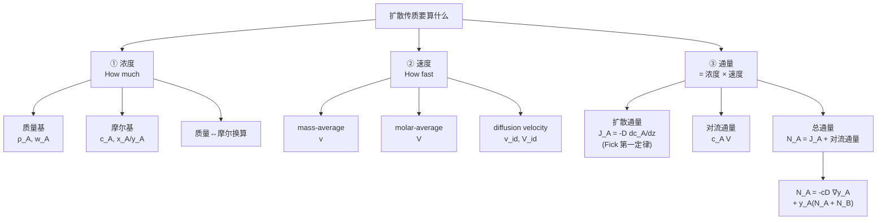

# 扩散传质 — 浓度、速度、通量 / Diffusive Mass Transfer

> [!abstract] 本节定位
> - **在课程中的位置**: 第 2 周, L02
> - **前置知识**: [[L01_intro_to_mass_transfer]]（传质定义 + 扩散概念 + Fick 定律雏形）
> - **本节核心**: 把"传质要算什么"具体化 — 三个量级的语言（浓度 / 速度 / 通量），最终落在 **Fick 第一定律** 和 **总通量公式 $N_A$**。一旦能区分"扩散通量 $J_A$"和"对流通量"两种贡献，传质问题就有了通用框架。
> - **后续联系**: 后续讲会用 $N_A$ 公式解具体扩散问题（等摩尔反向扩散、单向扩散、稳态/非稳态扩散），以及用 Fick 第二定律处理瞬态浓度场

---

## 知识结构

---

## 知识块 1 — 浓度的四种语言

> 同一个"组分 A 有多少"，可以用 **质量基** 或 **摩尔基** 表达，还可以用 **绝对量** 或 **分数**。先把这套语言学顺了，后面公式才不会乱。

### (1) Mass Concentration（质量浓度）

$$\rho_A = \frac{m_A}{V}$$

- $\rho_A$ = 组分 A 的质量浓度（kg/m³）
- $m_A$ = 组分 A 的质量
- $V$ = 混合物总体积

**总质量浓度（密度）**：

$$\rho = \sum_{i=1}^{n} \rho_i$$

> 想象一个不规则区域里有 ●、○、△ 三种分子。$\rho_A$ 就是单位体积里的"●的总重"。
> 

### (2) Specific Volume（比容）

$$\upsilon = \frac{V}{m} = \frac{1}{\rho}$$

单位质量物质所占的体积，**密度的倒数**。气相处理里常见。

### (3) Mass Fraction（质量分数）

$$w_A = \frac{m_A}{m} = \frac{\rho_A}{\rho}$$

满足：

$$\sum_{i=1}^{n} w_i = 1$$

### (4) Molar Concentration（摩尔浓度）

$$c_A = \frac{n_A}{V} = \frac{\rho_A}{M_A}$$

- $c_A$ = 摩尔浓度（mol/m³）
- $n_A$ = mol of A
- $M_A$ = 组分 A 的分子量（kg/mol）

**气相**特有的形式（理想气体）：

$$c_A = \frac{n_A}{V} = \frac{P_A}{RT}$$

其中 $P_A$ = A 的分压（= mole fraction × total pressure）。

总摩尔浓度：

$$\sum_{i=1}^{n} c_i = c$$

### (5) Mole Fraction（摩尔分数）

固相和液相用 $x_A$：

$$x_A = \frac{n_A}{n} = \frac{c_A}{c}$$

气相用 $y_A$：

$$y_A = \frac{n_A}{n} = \frac{c_A}{c} = \frac{P_A}{P}$$

> 工程上常用约定：**$x$ 表液相 / $y$ 表气相**。后面学相平衡时（如 $y = K x$）这个约定贯穿全课。

### 质量分数 ↔ 摩尔分数换算

二元体系：

$$x_A = \dfrac{w_A / M_A}{w_A/M_A + w_B/M_B}$$

$$w_A = \dfrac{x_A M_A}{x_A M_A + x_B M_B}$$

$y_A$（气相）形式同上，把 $x_A$ 换成 $y_A$。

> [!tip] 延伸（非 PPT 内容）
> **直觉**：质量基偏向"重的组分"，摩尔基偏向"个数多的组分"。空气里 N₂ 个数多（79% 摩尔），但 O₂ 比 N₂ 重（32 vs 28）— 所以 O₂ 的摩尔分数小但质量分数会接近。换算公式保证了两种语言的一致性。

### Example 1：空气组分计算

> (原题) 空气两组分：$y_{O_2}=0.21$、$y_{N_2}=0.79$；$M_{O_2}=0.032$ kg/mol、$M_{N_2}=0.028$ kg/mol；条件 25 °C、101300 Pa abs。
>
> 求：(i) 平均分子量 (ii) O₂ 和 N₂ 质量分数 (iii) O₂ 和 N₂ 摩尔浓度

**思路**：
1. 平均分子量 $\bar{M} = \sum y_i M_i$（按摩尔分数加权）
2. 质量分数 $w_i = y_i M_i / \bar{M}$
3. 总摩尔浓度 $c = P/(RT)$，分摩尔浓度 $c_i = y_i \cdot c$

**解答**：

$$\bar{M} = 0.21 \times 0.032 + 0.79 \times 0.028 \approx 0.0288 \text{ kg/mol}$$

$$w_{O_2} = \frac{0.21 \times 0.032}{0.0288} \approx 0.233; \quad w_{N_2} = 1 - 0.233 = 0.767$$

$$c = \frac{P}{RT} = \frac{101300}{8.314 \times 298.15} \approx 40.87 \text{ mol/m}^3$$

$$c_{O_2} = 0.21 \times 40.87 \approx 8.58 \text{ mol/m}^3; \quad c_{N_2} = 0.79 \times 40.87 \approx 32.29 \text{ mol/m}^3$$

> [!warning] 请核实
> 数值答案是按 $R=8.314$ J/(mol·K)、$T=298.15$ K 算的，建议自己再算一遍。

---

## 知识块 2 — 三种速度

> 在多组分混合物里，每个组分的速度一般**不一样**。我们要区分三种"平均速度"和一个"扩散速度"。

### (1) Mass-Average Velocity（质量平均速度）

按**质量浓度**加权：

$$\mathbf{v} = \frac{\sum_{i=1}^{n} \rho_i \mathbf{v}_i}{\sum_{i=1}^{n} \rho_i} = \frac{\sum \rho_i \mathbf{v}_i}{\rho} = \sum_{i=1}^{n} w_i \mathbf{v}_i$$

> **动量守恒里的速度** — 流体力学里 N-S 方程用的就是这个 $\mathbf{v}$。

### (2) Molar-Average Velocity（摩尔平均速度）

按**摩尔浓度**加权：

$$\mathbf{V} = \frac{\sum_{i=1}^{n} c_i \mathbf{v}_i}{\sum c_i} = \frac{\sum c_i \mathbf{v}_i}{c} = \sum_{i=1}^{n} x_i \mathbf{v}_i$$

> **传质里更自然的速度** — Fick 定律的"扩散通量"是相对于这个 $\mathbf{V}$ 定义的。

### (3) Diffusion Velocity（扩散速度）

某组分相对于平均速度的速度。两种 basis：

$$v_{id} = \mathbf{v}_i - \mathbf{v} \quad \text{（相对 mass-average velocity）}$$

$$V_{id} = \mathbf{v}_i - \mathbf{V} \quad \text{（相对 molar-average velocity）}$$

> [!tip] 延伸（非 PPT 内容）
> 一般情况下 $\mathbf{v} \neq \mathbf{V}$，因为它们权重不同（一个用 $w_i$，一个用 $x_i$）。**只有当所有组分分子量相同时**两者相等。这就是为什么不同教材会在两种 velocity 之间切换 — 不同问题用不同的更方便。

### Example 2：混合气速度

> (原题) 混合气含 65 mol% NH₃、8 mol% N₂、24 mol% H₂、3 mol% Ar，管径 25 mm，总压 4 atm。各组分速度：NH₃ 0.03 m/s、N₂ 0.03 m/s、H₂ 0.035 m/s、Ar 0.02 m/s。求 molar-average velocity、mass-average velocity、H₂ 的 mass diffusion velocity。

**思路**：
1. **Molar-average**：$\mathbf{V} = \sum x_i \mathbf{v}_i$（最直接）
2. **Mass-average**：先算各组分质量分数 $w_i = (x_i M_i)/\sum x_j M_j$，再 $\mathbf{v} = \sum w_i \mathbf{v}_i$
3. **H₂ mass diffusion velocity**：$v_{H_2,d} = \mathbf{v}_{H_2} - \mathbf{v}$

**量级估算**：所有组分速度都在 0.02-0.035 m/s 范围 → 平均速度也应在 ~0.03 m/s 量级。

**解答框架**（具体数值留作练习）：

$$\bar{M} = 0.65 \times 17 + 0.08 \times 28 + 0.24 \times 2 + 0.03 \times 40 \approx 14.97 \text{ g/mol}$$

$$w_{NH_3} = \frac{0.65 \times 17}{14.97}, \quad w_{N_2} = \frac{0.08 \times 28}{14.97}, \quad \text{etc.}$$

> [!warning] 请核实
> PPT 没给答案，建议自己算完和老师/tutorial 对照。

> [!tip] 延伸（非 PPT 内容）
> 这题是**典型陷阱**：H₂ 摩尔分数小（24%）但分子量极小（2），算 mass fraction 时会被压到很低，所以它的 mass-average 贡献小但 molar-average 贡献中等。**diffusion velocity 量级不大但符号要算清**（$v_{H_2}$ 比平均快还是慢）。

---

## 知识块 3 — Fick 第一定律 + 扩散通量

### Fick 在 1855 年量化扩散

**通量（Flux）**：单位时间通过单位截面积的某组分的量（**质量** 或 **摩尔**）。

**Fick 第一定律**（等温等压条件下）：

$$\boxed{\mathbf{J}_A = -D_{AB} \nabla c_A}$$

z 方向二元体系：

$$\boxed{J_{A,z} = -D_{AB} \dfrac{dc_A}{dz}}$$

- $J_{A,z}$ = 组分 A 的摩尔扩散通量（mol/(m²·s)）
- $D_{AB}$ = A 在 B 中的扩散系数 / 扩散率（m²/s）
- $dc_A/dz$ = 浓度梯度（$c_A$ 单位 mol/m³，$z$ 单位 m）
- **负号**：扩散方向沿浓度**降低**方向

### 同一定律的不同形式

| 用什么浓度量 | 公式 | 通量单位 |
|---|---|---|
| 摩尔浓度 $c_A$ | $J_{A,z} = -D_{AB} \dfrac{dc_A}{dz}$ | mol/(m²·s) |
| 摩尔分数 $y_A$ | $J_{A,z} = -c D_{AB} \dfrac{dy_A}{dz}$ | mol/(m²·s) |
| 质量浓度 $\rho_A$ | $j_{A,z} = -D_{AB} \dfrac{d\rho_A}{dz}$ | kg/(m²·s) |
| 质量分数 $w_A$ | $j_{A,z} = -\rho D_{AB} \dfrac{dw_A}{dz}$ | kg/(m²·s) |

> 大写 $J$ 表摩尔扩散通量，小写 $j$ 表质量扩散通量 —— 这是惯例，**别混用**。
> 公式里 $c_A = c \cdot y_A$、$\rho_A = \rho \cdot w_A$ 是不同形式之间的桥梁。

### Example 3：He-N₂ 扩散通量

> (原题) He / N₂ 混合气在管中，298 K、1 atm 总压。一端 He 分压 0.6 atm，另一端 0.2 atm，相距 0.2 m。$D_{He-N_2} = 0.687 \times 10^{-4}$ m²/s。求稳态下 He 的 molar 和 mass flux。

**思路**：
1. 稳态 + 一维 → 浓度梯度近似线性：$dc_A/dz \approx \Delta c_A / \Delta z$
2. 把分压差转成浓度差：$\Delta c_A = \Delta P_A / (RT)$
3. 直接代 Fick 第一定律
4. 摩尔通量 → 乘 $M_{He} = 0.004$ kg/mol → 质量通量

**量级估算**：$D \sim 10^{-4}$ m²/s（气相扩散典型值），$\Delta c/\Delta z \sim$ 10 mol/m³ / 0.2 m = 50 mol/m⁴ → $J \sim 10^{-4} \times 50 \sim 5 \times 10^{-3}$ mol/(m²·s)。

**解答**：

$$\Delta P_A = 0.6 - 0.2 = 0.4 \text{ atm} = 40520 \text{ Pa}$$

$$\Delta c_A = \frac{\Delta P_A}{RT} = \frac{40520}{8.314 \times 298} \approx 16.36 \text{ mol/m}^3$$

$$J_{He} = -D_{He-N_2} \frac{\Delta c_A}{\Delta z} = -0.687 \times 10^{-4} \times \frac{-16.36}{0.2} \approx 5.62 \times 10^{-3} \text{ mol/(m}^2\text{·s)}$$

$$j_{He} = J_{He} \times M_{He} = 5.62 \times 10^{-3} \times 0.004 \approx 2.25 \times 10^{-5} \text{ kg/(m}^2\text{·s)}$$

和量级估算 $\sim 5 \times 10^{-3}$ 吻合。

### Example 4：铁板渗碳/脱碳

> (原题) 铁板一侧暴露在富碳气氛、另一侧贫碳气氛，700 °C 稳态。距渗碳面 5 mm 和 10 mm 处碳浓度分别 100 和 66.67 mol/m³。$D = 3 \times 10^{-7}$ cm²/s。求碳在板内的扩散通量。

**思路**：和 Example 3 同框架，注意单位换算（cm² → m²）。

**单位换算**：$D = 3 \times 10^{-7}$ cm²/s $= 3 \times 10^{-11}$ m²/s

**解答**：

$$\frac{dc_A}{dz} \approx \frac{66.67 - 100}{(10-5) \times 10^{-3}} = \frac{-33.33}{5 \times 10^{-3}} = -6666 \text{ mol/m}^4$$

$$J_C = -D \frac{dc_A}{dz} = -3 \times 10^{-11} \times (-6666) \approx 2 \times 10^{-7} \text{ mol/(m}^2\text{·s)}$$

> 固相扩散通量 $\sim 10^{-7}$，比气相 Example 3 的 $\sim 10^{-3}$ 小了 4 个数量级 — 这就是 [[L01_intro_to_mass_transfer]] 里说的"气体 ≫ 液体 ≫ 固体"在数字上的体现。

> [!tip] 延伸（非 PPT 内容）
> $D = 3 \times 10^{-7}$ cm²/s 这种"小到可怕"的扩散系数其实对**金属热处理**（淬火、渗碳）至关重要。一个 cm 厚的铁板要渗到 1mm 深需要的时间可以用 $\tau \sim L^2/D$ 估出来 ≈ 数小时。

---

## 知识块 4 — 总通量 $N_A$：扩散 + 对流

### 关键认识：组分 A 的总流量来自两个贡献

> Fick 定律 $J_A$ 只算了**扩散贡献**（相对运动流体）。但站在**实验室静止参考系**看，A 还会被整体流体的对流"携带"过去。所以**总通量 = 扩散 + 对流**。

### 速度分解

> 
> **图例**：$\mathbf{v}_A$ = A 相对静止参考系的速度；$V_{Ad}$ = A 相对运动流体的扩散速度；$\mathbf{V}$ = 整体流体的摩尔平均速度（对流速度）。

$$\mathbf{v}_A = V_{Ad} + \mathbf{V}$$

两边乘 $c_A$：

$$\underbrace{c_A \mathbf{v}_A}_{\text{总通量}} = \underbrace{c_A V_{Ad}}_{\text{扩散通量（相对运动流体）}} + \underbrace{c_A \mathbf{V}}_{\text{对流通量（bulk motion）}}$$

定义 **总通量** $\mathbf{N}_A = c_A \mathbf{v}_A$，**扩散通量** $J_A = c_A V_{Ad}$（这就是 Fick 定律），就有：

$$\mathbf{N}_A = J_A + c_A \mathbf{V}$$

### 推导：把 $\mathbf{V}$ 用 $N_A, N_B$ 表示

$$\mathbf{V} = \frac{1}{c}\big(c_A \mathbf{v}_A + c_B \mathbf{v}_B\big) = \frac{1}{c}(\mathbf{N}_A + \mathbf{N}_B)$$

代回上面（注意 $c_A/c = y_A$）：

$$\boxed{\mathbf{N}_A = -c D_{AB} \nabla y_A + y_A (\mathbf{N}_A + \mathbf{N}_B)}$$

z 方向：

$$N_{A,z} = -c D_{AB} \dfrac{dy_A}{dz} + y_A (N_{A,z} + N_{B,z})$$

> **解读**：第一项是 Fick 扩散贡献（朝低浓度），第二项是对流携带（按摩尔分数 $y_A$ 分到组分 A 的那份）。

### 多组分推广

A 在 n 个组分混合物里扩散：

$$\mathbf{N}_A = -c D_{AM} \nabla y_A + y_A \sum_{i=1}^{n} \mathbf{N}_i$$

其中 $D_{AM}$ 是 A 在混合物里的有效扩散系数。

### 质量基的对应公式

$$\boxed{\mathbf{n}_A = -\rho D_{AB} \nabla w_A + w_A (\mathbf{n}_A + \mathbf{n}_B)}$$

其中 $\mathbf{n}_A = \rho_A \mathbf{v}_A$ 是 A 的总质量通量。

---

## 对比与总结

### 4 种 Fick 速率方程速查

| 总通量 | 梯度 | 方程 |
|---|---|---|
| $\mathbf{n}_A$ | $\nabla w_A$ | $\mathbf{n}_A = -\rho D_{AB} \nabla w_A + w_A(\mathbf{n}_A + \mathbf{n}_B)$ |
| $\mathbf{n}_A$ | $\nabla \rho_A$ | $\mathbf{n}_A = -D_{AB} \nabla \rho_A + w_A(\mathbf{n}_A + \mathbf{n}_B)$ |
| $\mathbf{N}_A$ | $\nabla y_A$ | $\mathbf{N}_A = -c D_{AB} \nabla y_A + y_A(\mathbf{N}_A + \mathbf{N}_B)$ |
| $\mathbf{N}_A$ | $\nabla c_A$ | $\mathbf{N}_A = -D_{AB} \nabla c_A + y_A(\mathbf{N}_A + \mathbf{N}_B)$ |

> 选用哪种取决于：相态（气相用 $y_A$、液相用 $x_A$）、给的数据形式（$P_A$、$c_A$、$w_A$、$\rho_A$）、解题方便度。

### Mass basis vs Molar basis 速查

| | Mass basis | Molar basis |
|---|---|---|
| 浓度 | $\rho_A$ (kg/m³) | $c_A$ (mol/m³) |
| 分数 | $w_A$ | $x_A$（液）/ $y_A$（气） |
| 平均速度 | $\mathbf{v} = \sum w_i \mathbf{v}_i$ | $\mathbf{V} = \sum x_i \mathbf{v}_i$ |
| 扩散速度 | $v_{id} = \mathbf{v}_i - \mathbf{v}$ | $V_{id} = \mathbf{v}_i - \mathbf{V}$ |
| 扩散通量 | $j_A$ (kg/(m²·s)) | $J_A$ (mol/(m²·s)) |
| 总通量 | $\mathbf{n}_A$ | $\mathbf{N}_A$ |
| Fick 定律 | $j_A = -D \nabla \rho_A$ | $J_A = -D \nabla c_A$ |

---

## 本节引入的核心概念

- [[质量浓度 ρA]]
- [[摩尔浓度 cA]]
- [[质量分数 wA]]
- [[摩尔分数 xA yA]]
- [[质量平均速度 v]]
- [[摩尔平均速度 V]]
- [[扩散速度 v_id V_id]]
- [[Fick 第一定律]]
- [[扩散通量 JA jA]]
- [[总通量 NA nA]]
- [[对流通量]]
- [[扩散系数 D_AB]]

---

## 我的疑问

> [!question]
> 1. **什么时候用 mass basis、什么时候用 molar basis**？教材上四种 Fick 形式怎么选？有什么经验法则（比如气相多用 molar，液相多用 mass）吗？
> 2. **$\mathbf{v}$（mass-average）和 $\mathbf{V}$（molar-average）什么时候相等**？除了"所有组分分子量相同"这种平凡情形，工业上有什么常见近似可以让二者等同？
> 3. **总通量公式 $N_A = -cD\nabla y_A + y_A(N_A + N_B)$ 里 $N_A$ 出现在等式两边** — 怎么解？是显式重排还是迭代？后续学的"等摩尔反向扩散"和"单向扩散"是不是就是为了消掉这个隐式项？
> 4. **Example 2 里 H₂ 的 mass diffusion velocity** — 我估计 $H_2$ 跑得最快（0.035 m/s），但 mass-average 速度被重组分（NH₃ 65%）拉低，所以 H₂ 的 diffusion velocity 应该是正的（比平均快）。怎么用直觉判断方向？
> 5. **Fick 第一定律的"等温等压"前提** — 现实工业过程几乎不可能严格等温等压。这个限制有多严苛？什么时候可以放心用，什么时候必须用 Stefan-Maxwell 方程？

---

## 个人补充

> [!note] 我的理解（待用户补充）
> ……

---

> [!info]- PPT 原文要点（Slides 1–27 浓缩）
>
> **Slides 1–3**: 课程封面 + 大纲（Concentrations/Velocities + Fluxes/Fick's Law）+ 章节扉页（装饰，已略过）
>
> **Slides 4–8（浓度）**: $\rho_A = m_A/V$；$\rho = \sum \rho_i$；$\upsilon = V/m = 1/\rho$；$w_A = m_A/m$；$\sum w_i = 1$；$c_A = n_A/V = \rho_A/M_A$；气相 $c_A = P_A/RT$；$\sum c_i = c$；$x_A = c_A/c$（固液）；$y_A = c_A/c = P_A/P$（气）；二元 mass↔mole fraction 换算双公式
>
> **Slide 9（Example 1）**: 空气 O₂ 21% / N₂ 79%，求 mean MW、mass fractions、molar concentrations
>
> **Slides 10–12（速度）**: $\mathbf{v} = \sum \rho_i \mathbf{v}_i / \rho = \sum w_i \mathbf{v}_i$；$\mathbf{V} = \sum c_i \mathbf{v}_i / c = \sum x_i \mathbf{v}_i$；diffusion velocity $v_{id} = \mathbf{v}_i - \mathbf{v}$ 和 $V_{id} = \mathbf{v}_i - \mathbf{V}$
>
> **Slide 13（Example 2）**: 4 组分混合气 NH₃/N₂/H₂/Ar 求 H₂ 的 molar-average、mass-average、mass diffusion velocity
>
> **Slides 14–17（Fick 定律 4 种形式）**: $J_A = -D_{AB} \nabla c_A$；$J_{A,z} = -D_{AB} dc_A/dz = -cD_{AB} dy_A/dz$；$j_{A,z} = -\rho D_{AB} dw_A/dz = -D_{AB} d\rho_A/dz$
>
> **Slides 18–19（Examples 3, 4）**: He-N₂ 气相扩散；铁板渗碳/脱碳固相扩散
>
> **Slides 20–25（总通量推导）**: $\mathbf{v}_A = V_{Ad} + \mathbf{V}$；$c_A \mathbf{v}_A = c_A V_{Ad} + c_A \mathbf{V}$；定义 $\mathbf{N}_A = c_A \mathbf{v}_A$；$\mathbf{V} = (\mathbf{N}_A + \mathbf{N}_B)/c$；推导出 $\mathbf{N}_A = -cD_{AB}\nabla y_A + y_A(\mathbf{N}_A + \mathbf{N}_B)$；多组分 $\mathbf{N}_A = -cD_{AM}\nabla y_A + y_A \sum \mathbf{N}_i$；质量基 $\mathbf{n}_A = -\rho D_{AB}\nabla w_A + w_A(\mathbf{n}_A + \mathbf{n}_B)$
>
> **Slide 26（汇总表）**: 4 种 Fick 速率方程（n_A 两种 + N_A 两种）+ 染料气球类比
>
> **Slide 27（Take Home）**: mass vs molar concentration、diffusion velocity、Fick's first law、扩散+对流分解
