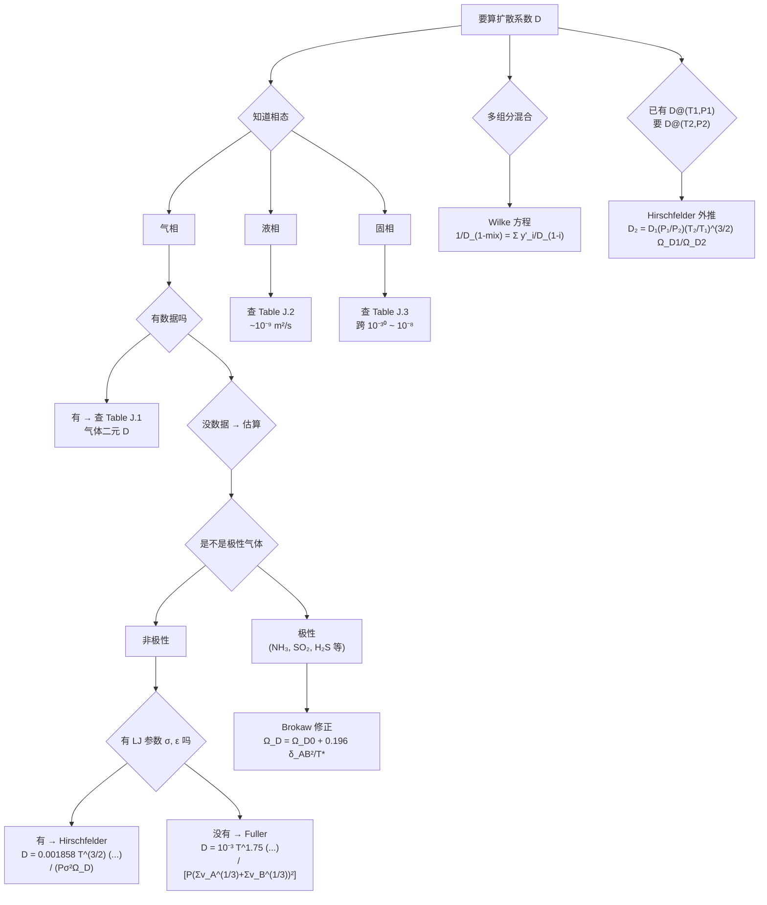

# 分子扩散系数与气体 D 的估算 / Molecular Diffusivity & Estimation of Gas Diffusion Coefficient

> [!abstract] 本节定位
> - **在课程中的位置**: 第 3 周, L03
> - **前置知识**: [[L02_diffusive_mass_transfer]]（Fick 第一定律 + 通量公式 — 但 $D$ 一直当成"已知数"）
> - **本节核心**: **$D$ 不是天上掉下来的**。本讲先从动力学理论推出气体自扩散公式（理想刚球假设），再放宽到 Lennard-Jones 实分子（Hirschfelder）→ 缺 LJ 参数时用 Fuller → 极性气体加 Brokaw 修正 → 多组分用 Wilke。最终形成一个**"何时用哪个公式"的决策树**。
> - **后续联系**: 后续讲会用这套 $D$ 估算法解具体的扩散问题（等摩尔反向扩散、单向扩散、Stefan 管），并进入液相扩散和瞬态扩散

---

## 知识结构



---

## 知识块 1 — 扩散系数 $D$ 的基本性质

### 维度推导

从 Fick 第一定律 $J_{A,z} = -D_{AB}\,dc_A/dz$ 反推 $D$ 的维度：

$$D_{AB} = \frac{-J_{A,z}}{dc_A/dz} = \frac{N/(L^2 t)}{N/L^3 \cdot 1/L} = \frac{L^2}{t}$$

**单位**：cm²/s 或 m²/s

### $D$ 依赖什么

- **压强 P**
- **温度 T**
- **组成（混合物里其他组分是什么）**
- **扩散介质（gas / liquid / solid）**

### 三态典型值（**必背**）

| 相态 | $D$ 量级（m²/s） |
|---|---|
| **气体** | $10^{-6}$ – $10^{-5}$ |
| **液体** | $10^{-10}$ – $10^{-9}$ |
| **固体** | $10^{-14}$ – $10^{-10}$（金属互扩散可低至 $10^{-30}$） |

> 一句话记：每跨一相态差 4–5 个数量级。这是后面所有量级估算的"重力场"。

### 关键性质：$D_{AB} = D_{BA}$（恒定摩尔浓度二元体系）

> [!success] 重要结论
> **在恒定摩尔浓度 $c$ 的二元系统里**：
>
> $$\boxed{D_{AB} = D_{BA}}$$
>
> 推导（核心两步）：
>
> 1. 总摩尔浓度恒定：$c_A + c_B = c = P/(RT)$ → $dc_A/dz = -dc_B/dz$
> 2. 等摩尔反向扩散：$J_A = -J_B$
>
> 代回 Fick 定律：$-D_{AB}\,(dc_A/dz) = -[-D_{BA}\,(dc_B/dz)]$，化简就得到 $D_{AB} = D_{BA}$。

> [!tip] 延伸（非 PPT 内容）
> "对称性"在液相不严格成立 — 液体里 $D_{AB}$ 和 $D_{BA}$ 接近但不完全相等，因为液相的"恒定摩尔浓度"假设不像气体那么干净。气体 + 等摩尔反向扩散是这个对称性最稳的成立条件。

---

## 知识块 2 — 三态扩散系数数据表

> 实际工程问题里，先**查表**，查不到再**估算**。教材附录有三张关键表。

### Table J.1：二元气体扩散系数（以 $D_{AB} P$ 形式给出）

数据形式：`D_AB · P (cm²·atm/s)` 或 `D_AB · P (m²·Pa/s)`

> 为什么乘 $P$？因为气体 $D \propto 1/P$（见知识块 4），所以 $D_{AB}P$ 在不同压强下近似不变，存表更紧凑。

**典型数据示例**（笔记里只举几行作 sanity check，完整查附件 PDF）：

| 体系 | T (K) | $D_{AB} P$ (cm²·atm/s) | $D_{AB} P$ (m²·Pa/s) |
|---|---|---|---|
| Air–CO₂ | 273 | 0.136 | 1.378 |
| Air–O₂ | 273 | 0.175 | 1.773 |
| Air–H₂O | 298 | 0.260 | 2.634 |
| Air–NH₃ | 273 | 0.198 | 2.006 |
| H₂–O₂ | 273 | 0.697 | 7.061 |
| He–H₂ | 293 | 1.64 | 16.61 |

> H₂ 和 He 这种轻气体的 $D$ 比重气体大 1 个量级 — 和分子量越小扩散越快的直觉一致。

### Table J.2：二元液体扩散系数（直接给 $D$）

数据形式：`D × 10⁵ (cm²/s)` 或 `D × 10⁹ (m²/s)`

| 溶质-溶剂 | T (K) | 浓度 | $D$ (m²/s) |
|---|---|---|---|
| NaCl–Water | 291 | 1.0 mol/L | $1.24 \times 10^{-9}$ |
| CO₂–Water | 293 | — | $1.77 \times 10^{-9}$ |
| NH₃–Water | 285 | — | $1.64 \times 10^{-9}$ |
| Ethanol–Water | 289 | — | $0.90 \times 10^{-9}$ |

> 液相 $D$ 都是 $\sim 10^{-9}$ m²/s 量级，和气相差 4 个数量级。

### Table J.3：固体扩散系数（跨度极大）

| 溶质-固体 | T (K) | $D$ (m²/s) |
|---|---|---|
| He–Pyrex | 293 | $4.49 \times 10^{-15}$ |
| He–Pyrex | 773 | $2.00 \times 10^{-12}$ |
| H₂–Nickel | 358 | $1.16 \times 10^{-12}$ |
| Bi–Pb | 293 | $1.10 \times 10^{-20}$ |
| Al–Cu | 293 | $1.30 \times 10^{-34}$ |

> [!warning] 固体扩散系数的极端跨度
> 同样是金属互扩散，He-Pyrex 在 773 K 是 $10^{-12}$，Al-Cu 在室温是 $10^{-34}$ — 跨 22 个数量级。**温度对固体 $D$ 影响远比对气液大**（Arrhenius 形式 $D \propto e^{-E_a/RT}$）。

> 完整数据查附件 PDF：`_attachments/CME 222 Lecture 3.pdf` 或主教材 Welty 7th 附录 J。

---

## 知识块 3 — 气体 $D$ 的动力学理论估算（自扩散）

### 4 条前提假设（**很重要，决定哪些公式能用**）

气体 $D$ 估算的第一性原理（kinetic theory of gases）建立在这 4 条假设上：

1. **理想气体**（$PV = nRT$ 严格成立）
2. **低密度气体**（分子间距 ≫ 分子尺寸）
3. **分子是刚球**（无分子间作用力，体积可忽略以外）
4. **碰撞是弹性的**（动能守恒）

### 自扩散系数（A 在 A* 同位素中扩散）

最简单情形：A 在自己的同位素 A* 里扩散。

**基本公式**（动力学理论第一原理）：

$$D_{AA*} = \frac{1}{3} \lambda u$$

其中：
- $\lambda$ = 平均自由程（mean free path）
- $u$ = 平均分子速度（mean speed）

**子公式**：

$$\lambda = \dfrac{\kappa T}{\sqrt{2}\,\pi \sigma_A^2 P}$$

$$u = \sqrt{\dfrac{8 \kappa N T}{\pi M_A}}$$

代入合并：

$$\boxed{D_{AA*} = \dfrac{2 T^{3/2}}{3 \pi^{3/2} \sigma_A^2 P} \left(\dfrac{\kappa^3 N}{M_A}\right)^{1/2}}$$

**参数**：

| 符号 | 含义 | 单位 |
|---|---|---|
| $M_A$ | 扩散组分 A 的分子量 | kg/mol |
| $N$ | Avogadro 常数 | $6.022 \times 10^{23}$ /mol |
| $P$ | 总压强 | Pa |
| $T$ | 绝对温度 | K |
| $\kappa$ | Boltzmann 常数 | $1.38 \times 10^{-23}$ J/K |
| $\sigma_A$ | A 分子的 Lennard-Jones 直径 | m |

### 关键概念：平均自由程 λ

分子在两次连续碰撞之间走过的平均距离。物理图像：

> 分子沿直线飞 → 碰一次 → 改方向 → 再飞 → 再碰 ……每段直线就是一次"自由路径"。

> [!tip] 延伸（非 PPT 内容）
> 标准状态下 $\lambda$ 量级：空气 $\sim 70$ nm（≈ 200 倍分子尺寸），所以"低密度"假设在常压下完全成立。但在真空设备 / MEMS 里压强降低后 $\lambda$ 增到几 mm 甚至几 cm，刚球碰撞模型就不够了。

### 关键概念：Lennard-Jones 直径 σ

碰撞直径：两分子近距离势能为零时的距离（**LJ 势能曲线穿过零点的位置**）。

```
势能 V(r)
  |
  |  *
  |   *
  |    *
  |     *_______r
  |  σ  /
  |    /
  |   /  极小值（最稳定平衡距离）
  | -ε
```

- 横轴 $r$ < σ：分子开始重叠，斥力剧增
- $r = \sigma$：势能 = 0
- $r$ 略大于 σ：势能极小（最稳）
- $r \to \infty$：势能 → 0（无相互作用）

参数 σ 和 ε 在教材附录有列表（如 N₂: σ = 3.798 Å, ε/κ = 71.4 K）。

### 二元混合（不等直径）

A 和 B **直径不同**（最一般情形）：

$$\boxed{D_{AB} = \dfrac{2}{3} \left(\dfrac{\kappa}{\pi}\right)^{3/2} N^{1/2} T^{3/2} \dfrac{\left(\dfrac{1}{2 M_A} + \dfrac{1}{2 M_B}\right)^{1/2}}{P \left(\dfrac{\sigma_A + \sigma_B}{2}\right)^2}}$$

> 这就是动力学理论给出的**最朴素的 $D_{AB}$ 公式**（刚球 + 无相互作用）。后面 Hirschfelder 是它的"加了 LJ 修正"版本。

### $D$ 与 P, T 的依赖关系（要会背）

$$D_{AB} \propto \frac{1}{P}, \qquad D_{AB} \propto T^{3/2}$$

- 压强降一半 → $D$ 升一倍
- 温度从 300K 升到 600K（×2）→ $D$ 升 $2^{3/2} \approx 2.83$ 倍

> [!tip] 延伸（非 PPT 内容）
> 实际气体（含 LJ 修正）$D$ 的温度依赖更接近 $T^{1.75}$（Fuller 公式的指数），不是严格 $T^{3/2}$。但 $1/P$ 的压力依赖是严格的（理想气体下）。

---

## 知识块 4 — Hirschfelder 公式（非极性气体的"标准答案"）

### 公式

$$\boxed{D_{AB} = \dfrac{0.001858\, T^{3/2} \left(\dfrac{1}{M_A} + \dfrac{1}{M_B}\right)^{1/2}}{P\, \sigma_{AB}^2\, \Omega_D}}$$

### 参数与单位（**严格按 Hirschfelder 公式单位制使用**）

| 符号 | 含义 | 单位 |
|---|---|---|
| $D_{AB}$ | 扩散系数 | cm²/s |
| $T$ | 绝对温度 | K |
| $M_A, M_B$ | 分子量 | g/mol |
| $P$ | 总压强 | atm |
| $\sigma_{AB}$ | LJ 碰撞直径 | Å |
| $\Omega_D$ | 碰撞积分 | 无量纲（查表/查图） |

> [!warning] 单位陷阱
> Hirschfelder 公式里 $P$ 是 **atm**、$\sigma$ 是 **Å**、$M$ 是 **g/mol**、$D$ 是 **cm²/s** — 和 SI 单位不一致。代入前把所有量统一到这套单位，结果直接是 cm²/s，**不要乘 10⁻⁴ 转 m²/s 之类的"自作多情"换算**。

### 关键组合规则（$\sigma_{AB}$ 和 $\varepsilon_{AB}$ 怎么从单组分参数得到）

> ⚠️ MinerU 漏抽这两条公式（在 PPT 上是右下角红框）。务必记住：

$$\boxed{\sigma_{AB} = \dfrac{\sigma_A + \sigma_B}{2}}$$

$$\boxed{\varepsilon_{AB} = \sqrt{\varepsilon_A\, \varepsilon_B}}$$

- $\sigma_{AB}$ 用**算术平均**
- $\varepsilon_{AB}$ 用**几何平均**

### 碰撞积分 $\Omega_D$

$\Omega_D$ 是无量纲温度 $\dfrac{\kappa T}{\varepsilon_{AB}}$ 的函数：

$$\Omega_D = f\left(\dfrac{\kappa T}{\varepsilon_{AB}}\right)$$

**怎么取值**：
1. 查教材附录表（最准确）
2. 查教材给的 $\Omega_D$ vs $\kappa T/\varepsilon_{AB}$ 曲线
3. 用 Lennard-Jones 拟合公式（见知识块 6）

**曲线特征**：
- $\kappa T/\varepsilon_{AB}$ 小（低温）→ $\Omega_D$ 大（约 2-3）
- $\kappa T/\varepsilon_{AB}$ 大（高温）→ $\Omega_D$ 接近 1

> [!tip] 延伸（非 PPT 内容）
> $\Omega_D = 1$ 是"刚球极限"。$\Omega_D > 1$ 表示低温下分子间吸引力让碰撞频率变高，扩散变慢。这就是为什么知识块 3 的纯刚球公式（隐含 $\Omega_D = 1$）在低温下高估 $D$。

### Hirschfelder 外推公式（**例题里超常用**）

已知 $D_{AB}$ at $(T_1, P_1)$，求 $D_{AB}$ at $(T_2, P_2)$：

$$\boxed{D_{AB,T_2,P_2} = D_{AB,T_1,P_1} \cdot \dfrac{P_1}{P_2} \cdot \left(\dfrac{T_2}{T_1}\right)^{3/2} \cdot \dfrac{\Omega_{D,T_1}}{\Omega_{D,T_2}}}$$

省去全部 LJ 计算，**只要查 $\Omega_D$ 比值**就能外推。

### Example 1：用 Hirschfelder 估算 CO₂ 在空气中的 $D$

> (原题) Determine $D_{CO_2-air}$ at 20°C and 1 atm using Hirschfelder equation.

**思路**：
1. 查表得 $\sigma_{CO_2}$、$\varepsilon_{CO_2}/\kappa$、$\sigma_{air}$、$\varepsilon_{air}/\kappa$
2. 用组合规则算 $\sigma_{AB}$、$\varepsilon_{AB}/\kappa$
3. 算无量纲温度 $\kappa T/\varepsilon_{AB} = T/(\varepsilon_{AB}/\kappa)$
4. 查 $\Omega_D$ 表/曲线
5. 代 Hirschfelder 公式

**量级估算**：气相 $D \sim 10^{-5}$ m²/s = $10^{-1}$ cm²/s 量级。课本/Table J.1 里 Air-CO₂ @ 273K 给出 $D = 0.136$ cm²/s，所以 20°C ≈ 293K 的答案应该接近 0.15 cm²/s 上下。

> [!warning] 请核实
> 完整解答需要查 LJ 参数表 + $\Omega_D$ 表，建议自己做完和老师/tutorial 对答案。

---

## 知识块 5 — Fuller 公式（缺 LJ 参数时的退路）

### 适用场景

当 $\sigma$ 或 $\varepsilon$ 找不到（比如新化合物、复杂有机分子）时，用 Fuller 经验公式。

### 公式

$$\boxed{D_{AB} = \dfrac{10^{-3}\, T^{1.75}\, \left(\dfrac{1}{M_A} + \dfrac{1}{M_B}\right)^{1/2}}{P \left[(\Sigma v)_A^{1/3} + (\Sigma v)_B^{1/3}\right]^2}}$$

**参数**：

| 符号 | 含义 | 单位 |
|---|---|---|
| $D_{AB}$ | 扩散系数 | cm²/s |
| $T$ | 温度 | K |
| $M_A, M_B$ | 分子量 | g/mol |
| $P$ | 总压强 | atm |
| $\Sigma v$ | 分子的扩散体积之和 | 无量纲（查表） |

### 扩散体积 $\Sigma v$ 怎么取

**方法 1**：分子整体查表（如 N₂、CO₂、空气、CCl₂F₂ 等常见简单分子）

**方法 2**：原子加和 — PPT 给了表格：

| 原子 / 结构 | 增量 $v$ |
|---|---|
| C | 16.5 |
| H | 1.98 |
| O | 5.48 |
| N | 5.69 |
| Aromatic ring | -20.2 |
| Heterocyclic ring | -20.2 |
| Cl | 19.5 |
| ... | ... |

> 苯（C₆H₆）：$6 \times 16.5 + 6 \times 1.98 - 20.2 = 90.68$（六个 C + 六个 H + 一个芳环修正）

> [!warning] MinerU OCR 错误
> Slide 23 表格里写 `CCIF2`，实际应为 `CCl2F2`（CFC-12，二氯二氟甲烷）。Cl 被误识为 I。

### Hirschfelder vs Fuller 怎么选

| 标准 | Hirschfelder | Fuller |
|---|---|---|
| 理论基础 | LJ 势 + 动力学理论 | 经验拟合 |
| 需要参数 | $\sigma$、$\varepsilon$、$\Omega_D$ | 扩散体积 $\Sigma v$（查表/原子加和） |
| 精度 | 高（5-10% 误差） | 中（10-15% 误差） |
| $T$ 指数 | $T^{3/2}$（× $\Omega_D^{-1}$） | $T^{1.75}$ |
| 适用 | 简单非极性分子 | 复杂分子 / 缺 LJ 参数 |

### Example 2：Fuller 估 benzene in air

> (原题) Determine $D_{benzene-air}$ at 30°C and 1 atm using Fuller equation.

**思路**：
1. 苯的 $\Sigma v = 90.68$（上面算过）
2. 空气的 $\Sigma v$ 整体查表 ≈ 19.7
3. 代 Fuller 公式

---

## 知识块 6 — 极性气体修正：Brokaw 方程

### 适用场景

极性气体（**有偶极矩 $\mu_p$**）。例：NH₃、SO₂、H₂S、H₂O。

> 极性气体之间额外有偶极-偶极作用，用普通 Hirschfelder 会低估 $\Omega_D$。

### Brokaw 修正

主公式（在 Hirschfelder 框架下，**只把 $\Omega_D$ 替换**）：

$$\boxed{\Omega_D = \Omega_{D_0} + \dfrac{0.196\, \delta_{AB}^2}{T^*}}$$

其中：
- $\Omega_{D_0}$ = 非极性 LJ 碰撞积分（拟合公式见下）
- $T^* = \kappa T / \varepsilon_{AB}$ = 无量纲温度

### 极性参数 $\delta$（**关键**）

单组分：

$$\delta = \dfrac{1.94 \times 10^3\, \mu_p^2}{V_b\, T_b}$$

| 符号 | 含义 | 单位 |
|---|---|---|
| $\mu_p$ | 偶极矩 | Debye (D) |
| $V_b$ | 沸点摩尔体积 | cm³/mol |
| $T_b$ | 沸点 | K |

混合 $\delta$（几何平均）：

$$\delta_{AB} = \sqrt{\delta_A\, \delta_B}$$

### 极性气体的 $\sigma$、$\varepsilon$ 替代公式

LJ 参数 $\sigma$、$\varepsilon$ 用沸点摩尔体积 $V_b$、沸点 $T_b$、$\delta$ 反算：

$$\dfrac{\varepsilon}{\kappa} = 1.18 (1 + 1.3\,\delta^2)\, T_b$$

$$\sigma = \left[\dfrac{1.585\, V_b}{1 + 1.3\,\delta^2}\right]^{1/3}$$

混合规则（同 Hirschfelder）：

$$\dfrac{\varepsilon_{AB}}{\kappa} = \sqrt{\dfrac{\varepsilon_A}{\kappa}\, \dfrac{\varepsilon_B}{\kappa}}, \qquad \sigma_{AB} = \sqrt{\sigma_A\, \sigma_B}$$

### $\Omega_{D_0}$ 拟合公式（8 常数）

$$\Omega_{D_0} = \dfrac{A}{(T^*)^B} + \dfrac{C}{\exp(D T^*)} + \dfrac{E}{\exp(F T^*)} + \dfrac{G}{\exp(H T^*)}$$

| 常数 | 值 |
|---|---|
| A | 1.06036 |
| B | 0.15610 |
| C | 0.19300 |
| D | 0.47635 |
| E | 1.03587 |
| F | 1.52996 |
| G | 1.76474 |
| H | 3.89411 |

> 实操里直接查 $\Omega_D$ 表/曲线就行，这个公式是给写程序用的。

### Example 3：Brokaw 估 NH₃ in air

> (原题) NH₃ 在空气中，101325 Pa / 373 K。NH₃ 沸点 239.81 K，空气沸点 78.8 K，NH₃ 偶极矩 1.46 D，空气偶极矩 0。

**思路**：
1. NH₃ 是极性 → 用 Brokaw
2. 算 $\delta_{NH_3}$（用 $\mu_p$、$V_b$、$T_b$），$\delta_{air} = 0$ → $\delta_{AB} = 0$（air 偶极为 0 直接干掉混合 $\delta$）
3. 算 $\sigma_{AB}$、$\varepsilon_{AB}$（NH₃ 用极性公式，air 用普通 LJ 表）
4. 算 $T^*$、$\Omega_{D_0}$、$\Omega_D$
5. 代 Hirschfelder 主公式得 $D$

> [!tip] 延伸（非 PPT 内容）
> 这题里 air 是非极性 → $\delta_{air} = 0$ → $\delta_{AB} = 0$ → Brokaw 修正项消失！这意味着 **A 极性 + B 非极性时，Brokaw 退化成 Hirschfelder**。Brokaw 只在 A、B 都极性时才真正起作用。

---

## 知识块 7 — 多组分混合：Wilke 方程

### 适用场景

A 在多组分混合物 (B, C, D, ...) 里扩散。**不是 A 单独和 B 之间**，所以不能直接用 $D_{AB}$。

### 公式

$$\boxed{D_{1-\text{mixture}} = \dfrac{1}{\dfrac{y_2'}{D_{1-2}} + \dfrac{y_3'}{D_{1-3}} + \cdots + \dfrac{y_n'}{D_{1-n}}}}$$

其中 $y_i'$ 是**除组分 1 以外**重新归一化的摩尔分数：

$$y_i' = \dfrac{y_i}{1 - y_1} \quad (i = 2, 3, \ldots, n)$$

满足 $\sum_{i \geq 2} y_i' = 1$。

### 物理含义（直觉）

把 A 在每个 B/C/D 单独的扩散系数 $D_{1-i}$ 看成"阻力的倒数"，然后**按其他组分相对比例做加权调和平均**。这是"并联扩散阻力"的思路。

### Example 4：CVD silane on silicon wafer

> (原题) CVD 过程，气相组成：$y_{SiH_4} = 0.0075$、$y_{H_2} = 0.015$、$y_{N_2} = 0.9775$，900 K、100 Pa。SiH₄ 的 LJ 参数：$\varepsilon_A/\kappa = 207.6$ K，$\sigma_A = 4.08$ Å。

**思路**：
1. 重新归一化（去掉 SiH₄）：$y_{H_2}' = 0.015/0.9925$，$y_{N_2}' = 0.9775/0.9925$
2. 用 Hirschfelder 算 $D_{SiH_4-H_2}$ 和 $D_{SiH_4-N_2}$
3. 代 Wilke 公式得 $D_{SiH_4-mixture}$

---

## 对比与总结

### 决策树（根据问题特征选公式）

```
     ┌──────────────────────┐
     │ 想算气相 D            │
     └──┬───────────────────┘
        │
   ┌────▼────┐
   │ 数据库  │── 有 → 查 Table J.1
   │ 有 D ?  │
   └────┬────┘
        │ 没有
        │
   ┌────▼────────┐
   │ 极性吗？    │
   └────┬────────┘
        │
        ├── 否 ──┐
        │       │
        │   ┌───▼─────┐
        │   │ 有 σ, ε │── 有 → Hirschfelder
        │   │ 参数？  │── 没 → Fuller
        │   └─────────┘
        │
        └── 是 ──→ Brokaw 修正

     ┌──────────────────────┐
     │ 多组分混合           │── Wilke 调和平均
     └──────────────────────┘

     ┌──────────────────────┐
     │ 已知 D@(T1,P1) 求 (T2,P2) │── Hirschfelder 外推
     └──────────────────────┘
```

### 5 大公式速查

| 方法 | 公式骨架 | 必要参数 | 适用 |
|---|---|---|---|
| **动力学（自扩散）** | $D \propto T^{3/2}/(P \sigma^2)$ | $\sigma_A$ | 同位素互扩散，理论参考 |
| **动力学（二元）** | $D \propto T^{3/2} \dfrac{(1/M_A + 1/M_B)^{1/2}}{P \sigma_{AB}^2}$ | $\sigma_A, \sigma_B, M_A, M_B$ | 刚球假设，粗略估算 |
| **Hirschfelder** | 加 $\Omega_D$ 修正：$D = \dfrac{0.001858 T^{3/2}(...)^{1/2}}{P \sigma_{AB}^2 \Omega_D}$ | $\sigma, \varepsilon$（LJ 参数） | 非极性，标准方法 |
| **Fuller** | $D \propto \dfrac{T^{1.75}(1/M_A + 1/M_B)^{1/2}}{P[(\Sigma v_A)^{1/3} + (\Sigma v_B)^{1/3}]^2}$ | $\Sigma v$（扩散体积） | 缺 LJ 参数时 |
| **Brokaw**（极性） | Hirschfelder + $\Omega_D \to \Omega_{D_0} + 0.196 \delta_{AB}^2/T^*$ | + $\mu_p, V_b, T_b$ | 极性气体（NH₃, H₂O 等） |
| **Wilke**（多组分） | $1/D_{1-mix} = \sum y_i'/D_{1-i}$ | 各对 $D_{1-i}$ | 多组分混合 |

---

## 本节引入的核心概念

- [[扩散系数 D_AB]]
- [[D_AB 与 D_BA 对称性]]
- [[平均自由程 λ]]
- [[Lennard-Jones 势]]
- [[Lennard-Jones 直径 σ]]
- [[Lennard-Jones 阱深 ε]]
- [[碰撞积分 Ω_D]]
- [[Hirschfelder 公式]]
- [[Fuller 经验公式]]
- [[Brokaw 极性修正]]
- [[Wilke 多组分混合公式]]
- [[Stokes-Einstein 关系]]（液相，下一讲）
- [[Wilke-Chang 公式]]（液相，下一讲）

---

## 我的疑问

> [!question]
> 1. **Hirschfelder 公式的单位是 cm²/s，但工程上习惯 m²/s** — 实操里我应该先按 Hirschfelder 单位制算完，再换算吗？还是有一种 SI 单位的"重写版"？
> 2. **碰撞积分 $\Omega_D$ 表/曲线在哪查最方便**？教材附录看图取值精度大约多少？写程序时拟合公式的 8 常数（A=1.06036 ... H=3.89411）从哪来的？
> 3. **Hirschfelder 和 Fuller 的 $T$ 指数不一样**（$3/2$ vs $1.75$），这个差别在 200-500 K 内影响多大？什么时候必须用更准的 Hirschfelder？
> 4. **Brokaw 修正在 A 极性 + B 非极性的体系里"自动消失"**（Example 3 里 $\delta_{AB} = 0$）— 但直觉上 A 是极性这件事还是会影响 $D$ 啊？是不是说 Brokaw 主要修正"两个极性分子之间的偶极-偶极作用"，而不是"极性分子和非极性分子的碰撞"？
> 5. **Wilke 公式是"调和平均"** — 物理上这是说 $D$ 的倒数（即"扩散阻力"）按摩尔分数加权。这种"阻力并联"思路在传热里有没有对应物（比如 $1/U = 1/h_1 + 1/h_2$）？
> 6. **MinerU 把 PPT 上的 ρ、ω、λ、ε、σ 全部识别成了 ?? 乱码**，这是 OCR 局限。以后我自己看公式时怎么快速识别"这是什么希腊字母"？教材附录有没有标准 LJ 参数表的电子版？

---

## 个人补充

> [!note] 我的理解（待用户补充）
> ……

---

> [!info]- PPT 原文要点（Slides 1–32 浓缩）
>
> **Slides 1–3**: 课程封面 + 大纲（Molecular Diffusivity + Estimation of Gas Diffusivity）+ 章节扉页
>
> **Slide 4（D 维度）**: $D = (L^2/t)$，单位 cm²/s 或 m²/s；依赖 P、T、组成、介质；三态量级（气 1e-6~1e-5、液 1e-10~1e-9、固 1e-14~1e-10 m²/s）
>
> **Slides 5–8（数据表）**: J.1 二元气体 D（以 $D \cdot P$ 形式）；J.2 二元液体 D；J.3 二元固体 D（跨度极大 1e-30~1e-8）
>
> **Slide 9**: $D_{AB} = D_{BA}$ 推导 — 恒定摩尔浓度二元体系 + 等摩尔反向扩散
>
> **Slide 11（4 条假设）**: 理想气体 + 低密度 + 刚球无相互作用 + 弹性碰撞
>
> **Slides 12–13（自扩散）**: $D_{AA*} = (1/3)\lambda u$；$\lambda = \kappa T/(\sqrt{2}\pi\sigma^2 P)$；$u = \sqrt{8\kappa N T/(\pi M_A)}$；合并 $D_{AA*} = 2T^{3/2}/(3\pi^{3/2}\sigma^2 P) \cdot (\kappa^3 N/M_A)^{1/2}$
>
> **Slide 14–15**: 平均自由程示意图；LJ 直径 σ 概念 + LJ 势能曲线
>
> **Slide 16**: 二元混合（不等直径）公式
>
> **Slide 17**: $D \propto 1/P$，$D \propto T^{3/2}$
>
> **Slide 18（Hirschfelder）**: $D_{AB} = 0.001858 T^{3/2}(1/M_A + 1/M_B)^{1/2} / (P \sigma_{AB}^2 \Omega_D)$；σ_AB 算术平均、ε_AB 几何平均
>
> **Slide 19**: $\Omega_D$ vs $\kappa T/\varepsilon_{AB}$ 曲线（查图用）
>
> **Slide 20**: Hirschfelder 外推公式（T1,P1 → T2,P2）
>
> **Slide 21（Example 1）**: CO₂ in air @ 20°C, 1 atm, Hirschfelder
>
> **Slides 22–23（Fuller）**: $D = 10^{-3} T^{1.75}(1/M_A+1/M_B)^{1/2} / [P(\Sigma v_A^{1/3}+\Sigma v_B^{1/3})^2]$；扩散体积增量表
>
> **Slide 24（Example 2）**: Benzene in air @ 30°C, Fuller
>
> **Slides 25–26（Brokaw 极性修正）**: $\Omega_D = \Omega_{D_0} + 0.196 \delta_{AB}^2/T^*$；$\delta = 1.94 \times 10^3 \mu_p^2/(V_b T_b)$；ε/κ = 1.18(1+1.3δ²)T_b；σ = [1.585 V_b/(1+1.3δ²)]^(1/3)；$\Omega_{D_0}$ 8 常数拟合公式
>
> **Slide 27（Example 3）**: NH₃ in air, Brokaw
>
> **Slide 28（Wilke）**: $1/D_{1-mix} = \sum y_i'/D_{1-i}$；$y_i' = y_i/(1-y_1)$
>
> **Slide 29（Example 4）**: CVD SiH₄ in H₂/N₂ 混合气
>
> **Slides 30–32（Take Home）**: 自扩散公式 + 二元 + Hirschfelder + Fuller + Brokaw + Wilke 全部速查
