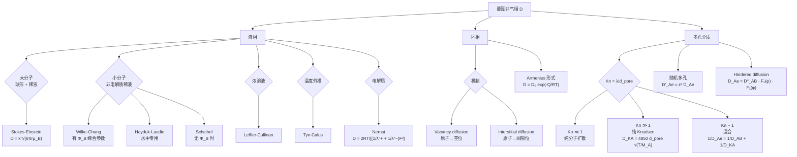

# 液相、固相、多孔扩散系数估算 / Estimation of Liquid, Solid & Pore Diffusivity

> [!abstract] 本节定位
> - **在课程中的位置**: 第 4 周, L04
> - **前置知识**: [[L03_diffusion_coefficient_estimation]]（气相 D 估算 — Hirschfelder / Fuller / Brokaw / Wilke）
> - **本节核心**: 把 L03 的"气相估算法"扩展到三个新场景：① **液相**（Stokes-Einstein 大分子稀液 / Wilke-Chang 系列经验式 / 电解质 Nernst）；② **固相**（vacancy + interstitial 机制 + Arrhenius 形式）；③ **多孔介质**（Knudsen 数判断 + 混合扩散 + tortuous 修正 + hindered diffusion）。本节是"传质开始用得起来"的转折点。
> - **后续联系**: 后续讲会用这套 D 解扩散问题（等摩尔反向、单向、稳态 / 瞬态扩散），并进入对流传质。

---

## 知识结构



---

# Part 1：液相扩散系数（Liquid Diffusivity）

## 知识块 1 — 液相扩散的基本特征

### 比气相难得多

- **理论不够成熟**：气相有动力学理论 + LJ 势作支撑；液相**没有同等漂亮的理论**
- **实验数据少**：教材附录 J.2 远没有 J.1 长
- **量级**：$D_{liq} \sim 10^{-9}$ m²/s，比气相小 4-5 个量级
- **特殊**：电解质（如 NaCl）以**离子**形式扩散，不是中性分子

### 两条理论思路

| 理论 | 思路 | 给出的公式 |
|---|---|---|
| **Eyring "hole" theory** | 液体 = 准晶格 + 大量空穴；分子跳到邻近空穴完成扩散 | 给出活化能形式（半经验） |
| **Hydrodynamical theory** | 看溶质分子在连续流体里受拖曳；力-速关系 | 给出 **Stokes-Einstein** 公式 |

> [!tip] 延伸（非 PPT 内容）
> Eyring 思路本质上把液体看成"很挤的固体"，扩散是分子"从一个站位跳到下一个"。Hydrodynamical 思路把液体看成"连续介质"，扩散是分子"被流体粘性拖着走"。两套观点结果数值相似但适用边界不同 — 大球用流体动力学（Stokes-Einstein），小分子用半经验（Wilke-Chang 系列）。

---

## 知识块 2 — Stokes-Einstein 方程（大分子 / 球形溶质）

### 适用场景

- **胶体颗粒**或**大的球形分子**
- **稀溶液**（溶剂可看作连续介质）
- 溶质比溶剂分子大很多

### 公式

$$\boxed{D_{AB} = \dfrac{kT}{6 \pi r \mu_B}}$$

| 符号       | 含义             | 单位                         |
| -------- | -------------- | -------------------------- |
| $D_{AB}$ | A 在稀液 B 中的扩散系数 | m²/s                       |
| $k$      | Boltzmann 常数   | $1.38 \times 10^{-23}$ J/K |
| $T$      | 绝对温度           | K                          |
| $r$      | 溶质粒子半径         | m                          |
| $\mu_B$  | 溶剂黏度           | kg/(m·s) = Pa·s            |

> 物理含义：**Stokes 拖曳力 $F = 6\pi r \mu v$ + Einstein 涨落-耗散 $D = kT/\zeta$** 联立 → 上式。这是**全 SI 单位**。

> [!tip] 延伸（非 PPT 内容）
> 这公式是**唯一有干净物理推导**的液相 D 估算式。后面的 Wilke-Chang / Hayduk-Laudie / Scheibel 都是经验拟合 — 数据点散在某个公式形式上拟合出来的。

---

## 知识块 3 — Wilke-Chang 方程（小分子非电解质稀液，主力公式）

### 适用场景

- **非电解质**（不是离子）
- **无限稀溶液**
- 溶质分子量**小到中等**（$M < 400$ g/mol）

### 公式

$$\boxed{D_{AB} = 7.4 \times 10^{-8} \, \dfrac{T \, (\Phi_B \, M_B)^{1/2}}{V_A^{0.6} \, \mu_B}}$$

> [!warning] 严重单位陷阱
> Wilke-Chang 是 **CGS 混合单位制**，和 Stokes-Einstein 不一样：
>
> | 符号 | 含义 | **必须的单位** |
> |---|---|---|
> | $D_{AB}$ | 扩散系数 | **cm²/s** |
> | $T$ | 温度 | K |
> | $\Phi_B$ | 溶剂缔合参数（**无量纲**） | — |
> | $M_B$ | 溶剂分子量 | g/mol |
> | $V_A$ | 溶质 normal boiling point molar volume | **cm³/mol** |
> | $\mu_B$ | 溶剂黏度 | **cP**（厘泊，1 cP = 1 mPa·s） |
>
> 套公式前**所有量都要转到这套单位**，否则数值差几个量级。

### 缔合参数 $\Phi_B$ 速查

| 溶剂 | $\Phi_B$ |
|---|---|
| **Water** | **2.26** |
| Methanol | 1.9 |
| Ethanol | 1.5 |
| Benzene / Ether / Heptane / 大多有机溶剂 | **1.0** |

> 缔合参数反映溶剂分子之间的相互作用强度（氢键越多 $\Phi$ 越大）。水是最强缔合的溶剂。

---

## 知识块 4 — 怎么估摩尔体积 $V_A$

> Wilke-Chang 和后面所有液相经验式都要 $V_A$。教材给了 3 种估法。

### 方法 1：直接查 Table 24.4（常见简单分子）

| 物质 | $V_A$ (cm³/mol) | 物质 | $V_A$ (cm³/mol) |
|---|---|---|---|
| H₂ | 14.3 | NO | 23.6 |
| O₂ | 25.6 | N₂O | 36.4 |
| N₂ | 31.2 | NH₃ | 25.8 |
| Air | 29.9 | H₂O | 18.9 |
| CO | 30.7 | H₂S | 32.9 |
| CO₂ | 34.0 | Br₂ | 53.2 |
| COS | 51.5 | Cl₂ | 48.4 |
| SO₂ | 44.8 | I₂ | 71.5 |

### 方法 2：原子加和（Table 24.5）

复杂有机分子，加各原子贡献：

| 原子 / 类型 | 贡献 (cm³/mol) |
|---|---|
| Carbon | 14.8 |
| Hydrogen | 3.7 |
| Bromine | 27.0 |
| Chlorine | 21.6 |
| Iodine | 37.0 |
| Nitrogen（双键） | 15.6 |
| Nitrogen（伯胺） | 10.5 |
| Nitrogen（仲胺） | 12.0 |
| Oxygen（除特殊外） | 7.4 |
| Oxygen（甲酯） | 9.1 |
| Oxygen（甲醚） | 9.9 |
| Oxygen（高级醚 + 其他酯） | 11.0 |
| Oxygen（酸） | 12.0 |
| Sulfur | 25.6 |

### 加和后做环结构修正

| 环类型       | 减去 (cm³/mol) |
| --------- | ------------ |
| 三元环（环氧乙烷） | -6           |
| 四元环（环丁烷）  | -8.5         |
| 五元环（呋喃）   | -11.5        |
| 吡啶环       | -15          |
| 苯环        | -15          |
| 萘环        | -30          |
| 蒽环        | -47.5        |

### 方法 3：用临界体积 $V_c$ 估

$$V_A = 0.285 \, V_c^{1.048}$$

其中 $V_c$ 是组分 A 的临界体积（cm³/mol，查物性手册）。

### 例：苯（C₆H₆）的 $V_A$

$$V_A = 6 \times 14.8 + 6 \times 3.7 - 15 = 96$$

（六个 C + 六个 H − 苯环修正）

---

## 知识块 5 — 其他液相经验式

> Wilke-Chang 不能用时（找不到 $\Phi_B$、不在水里、浓溶液、要外推温度）就要换公式。

### Hayduk-Laudie（水溶液专用）

> ⚠️ PPT 把 "Hayduk" 拼成 "Kayduk" — 是 PPT 笔误。学术正名是 **Hayduk and Laudie**。

**适用**：无限稀释 / 非电解质 / **溶剂必须是水**

$$\boxed{D_{AB} = 13.26 \times 10^{-5} \, \mu_B^{-1.14} \, V_A^{-0.589}}$$

单位：$D$ 是 cm²/s，$\mu_B$ 是 cP，$V_A$ 是 cm³/mol。

> 这公式**省掉了 $\Phi_B$**，对水体系比 Wilke-Chang 更便（因为水的 $\Phi$ 不是 1，套 Wilke-Chang 时容易记错）。

### Scheibel（消除 $\Phi_B$，更通用）

$$\boxed{D_{AB} = \dfrac{KT}{\mu_B \, V_A^{1/3}}}$$

其中：

$$K = 8.2 \times 10^{-8} \left[1 + \left(\dfrac{3 V_B}{V_A}\right)^{2/3}\right]$$

**例外修正**：
- 苯做溶剂、$V_A < 2 V_B$：$K = 18.9 \times 10^{-8}$
- 其他有机溶剂、$V_A < 2.5 V_B$：$K = 17.5 \times 10^{-8}$

### Leffler-Cullinan（浓溶液修正）

稀溶液假设破坏时（高浓度）：

$$D_{AB} \, \mu = (D^\circ_{AB} \, \mu_B)^{x_B} \, (D^\circ_{BA} \, \mu_A)^{x_A}$$

其中 $D^\circ_{AB}$、$D^\circ_{BA}$ 是无限稀释扩散系数（**两个方向不一样！**）；$x_A$、$x_B$ 是摩尔分数。

> [!warning] 关键 caveat（来自 Example 1 的提示框）
> **液相里 $D_{AB} \neq D_{BA}$**！这点和气相 [[L03_diffusion_coefficient_estimation]] 里 $D_{AB} = D_{BA}$ 的结论**完全不同**。原因：液相不像气相那样有"恒定摩尔浓度"的简单条件，方向性不可逆。

### Tyn-Calus（温度外推）

> ⚠️ PPT 拼成 "Tyne" — 学术正名是 **Tyn-Calus**。

已知 $D_{AB}$ at $T_1$，求 at $T_2$：

$$\boxed{\dfrac{D_{AB,T_1}}{D_{AB,T_2}} = \left(\dfrac{T_c - T_2}{T_c - T_1}\right)^n}$$

- $T_c$ = 溶剂临界温度（K）
- $n$ 由溶剂的蒸发焓 $\Delta H_v$（J/mol）决定：

| $\Delta H_v$（J/mol） | $n$ |
|---|---|
| 7,900 – 30,000 | 3 |
| 30,000 – 39,000 | 4 |
| 39,000 – 46,000 | 6 |
| 46,000 – 50,000 | 8 |
| > 50,000 | 10 |

---

## 知识块 6 — 电解质溶液的 Nernst 方程

### 为什么单独算

电解质 NaCl 溶解后变成 Na⁺ + Cl⁻ — **两个独立的离子分别扩散**，而且要保持电中性。普通经验式不能直接用。

### Nernst 公式（一价离子稀溶液）

$$\boxed{D_{AB} = \dfrac{2 R T}{\left(\dfrac{1}{\lambda^\circ_+} + \dfrac{1}{\lambda^\circ_-}\right) F_a^2}}$$

> ⚠️ **公式适用条件 callout**（MinerU 漏抽）：**For univalent ions only**（仅适用于一价离子，多价见下面修正）。

| 符号 | 含义 | 值 / 单位 |
|---|---|---|
| $R$ | 气体常数 | 8.314 J/(K·mol) |
| $T$ | 绝对温度 | K |
| $\lambda^\circ_+$ | 阳离子极限当量电导率 | A/cm² |
| $\lambda^\circ_-$ | 阴离子极限当量电导率 | A/cm² |
| $F_a$ | Faraday 常数 | **96500 C/mol** |

### 多价离子修正

把分子的 $2$ 替换成：

$$\dfrac{1}{n_+} + \dfrac{1}{n_-}$$

其中 $n_+$、$n_-$ 是阳/阴离子的电荷数。

### 极限离子电导率（25°C 水溶液）

| 阳离子 | $\lambda^\circ$ | 阴离子 | $\lambda^\circ$ |
|---|---|---|---|
| H⁺ | 349.8 | OH⁻ | 197.6 |
| Li⁺ | 38.7 | Cl⁻ | 76.3 |
| Na⁺ | 50.1 | Br⁻ | 78.3 |
| K⁺ | 73.5 | I⁻ | 76.8 |
| NH₄⁺ | 73.4 | NO₃⁻ | 71.4 |

> **直觉**：H⁺ 和 OH⁻ 远大于其他离子 — 这是因为它们走"质子跳跃"机制（Grotthuss mechanism），不是真的把整个离子拖过去。所以 HCl 和 NaOH 的扩散系数明显高于 NaCl。

---

## 液相 D 估算决策树

```
                ┌───────────────┐
                │ 想算液相 D    │
                └─────┬─────────┘
                      │
           ┌──────────▼──────────┐
           │ 是不是电解质？      │
           └──────────┬──────────┘
                ┌─────┴─────┐
                │           │
              No          Yes
                │           │
                │           └─→ Nernst（一价）/ 多价修正
                ▼
        ┌───────────────────┐
        │ 大球形分子？      │
        │ (蛋白质 / 胶体)   │
        └────┬──────────────┘
             ├─ Yes → Stokes-Einstein
             └─ No
                ▼
        ┌───────────────────┐
        │ 稀 or 浓？        │
        └────┬──────────────┘
             ├─ 浓 → Leffler-Cullinan
             └─ 稀
                ▼
        ┌───────────────────┐
        │ 溶剂是水？        │
        └────┬──────────────┘
             ├─ Yes → Hayduk-Laudie
             └─ No
                ▼
        ┌───────────────────┐
        │ 知道 Φ_B 吗？     │
        └────┬──────────────┘
             ├─ Yes → Wilke-Chang（主力）
             └─ No → Scheibel

  温度外推：Tyn-Calus（不论哪个公式得到的 D 都可外推）
```

---

# Part 2：固相扩散系数（Solid Diffusivity）

## 知识块 7 — 固相扩散的两种机制

固体里的"扩散"和气液完全不一样 — 原子被晶格束缚，要"跳跃"才行。

### Vacancy Diffusion（空位扩散）

- 原子从晶格位置**跳进邻近的空位**
- 连续多次跳跃实现宏观扩散
- 需要"推开"附近原子 → 需要**活化能** + 引起晶格畸变
- 速率取决于**空位浓度** + **活化能 Q**

### Interstitial Diffusion（间隙扩散）

- 原子从一个**间隙位**跳到邻近**间隙位**
- 涉及晶格膨胀和畸变
- 通常**比 vacancy 快**：
  - 扩散原子较小（如碳、氢这种小原子）
  - 间隙位**比空位多**（间隙到处都是，空位罕见）

### 工程实例

- **半导体掺杂**：B、P、As 等掺入 Si 控制电导率
- **钢铁渗碳**：碳原子扩散进铁，使表面硬化（间隙扩散）

> [!tip] 延伸（非 PPT 内容）
> 钢的渗碳处理是间隙扩散的典型应用 — 因为碳原子小（~0.7 Å），能挤进 Fe 的 fcc/bcc 间隙位。同样温度下碳的 D 比铁自扩散大 100 倍以上，所以渗碳几小时就够，但铁的"再结晶"就要烧很久。

---

## 知识块 8 — Arrhenius 方程

### 公式

$$\boxed{D_{AB} = D_0 \, \exp\left(-\dfrac{Q}{RT}\right)}$$

| 符号       | 含义                 |
| -------- | ------------------ |
| $D_{AB}$ | 扩散系数（m²/s 或 cm²/s） |
| $D_0$    | 频率因子 / 前指数因子       |
| $Q$      | 活化能（J/mol）         |
| $R$      | 气体常数               |
| $T$      | 绝对温度               |

> ⚠️ PPT Take Home 段把 $Q$ 写成了 $O$（MinerU 抽错），实际是**活化能 Q**（quaesitum）。

### 对数线性形式（图解法）

取对数：

$$\ln D_{AB} = -\dfrac{Q}{R} \cdot \dfrac{1}{T} + \ln D_0$$

→ **以 $1/T$ 为横轴、$\ln D$ 为纵轴**画图，得**直线**：
- 斜率 = $-Q/R$ → 反算活化能
- 截距 = $\ln D_0$ → 反算频率因子

### 横轴单位陷阱（PPT 第 29 页**整页 MinerU 漏抽**）

教材常用 $1000/T$ 当横轴（数字看着舒服），不是 $1/T$。两种横轴对应的拟合结果：

| 横轴 | 拟合直线（同一组数据） | $R^2$ |
|---|---|---|
| $1/T$ | $y = -118.26\,x + 0.2426$ | 0.9808 |
| $1000/T$ | $y = -0.1183\,x + 0.2426$ | 0.9808 |

**关键观察**：
- **斜率差 1000 倍**（横轴单位变 1000 倍）
- **截距相同**（截距对应 $T \to \infty$ 极限）

> [!warning] 易错点
> 看图反算 $Q$ 时，**先看清横轴是 $1/T$ 还是 $1000/T$**，别忘乘 / 除 1000。$Q = -slope \times R$，$R = 8.314$ J/(mol·K)。

---

## 知识块 9 — 固相扩散数据

### Table 24.6：金属自扩散

| 金属 | 结构 | $D_0$ (mm²/s) | $Q$ (kJ/mol) |
|---|---|---|---|
| Au | fcc | 10.7 | 176.9 |
| Cu | fcc | 31 | 200.3 |
| Ni | fcc | 190 | 279.7 |
| Fe (γ) | fcc | 49 | 284.1 |
| Fe (α) | bcc | 200 | 239.7 |
| Fe (δ) | bcc | 1980 | 238.5 |

> $D_0$ 单位是 mm²/s，套公式时注意换算。

### Table 24.7：铁中间隙扩散（C / N / H）

| 溶质  | Fe 结构  | $D_0$ (mm²/s) | $Q$ (kJ/mol) |
| --- | ------ | ------------- | ------------ |
| C   | bcc Fe | 2.0           | 84.1         |
| N   | bcc Fe | 0.3           | 76.1         |
| H   | bcc Fe | 0.1           | 13.4         |
| C   | fcc Fe | 2.5           | 144.2        |

> **注意 Q 的差异**：
> - H 在 Fe 里 Q = 13.4 kJ/mol（极小，氢原子小、室温就能扩散）
> - C/N 在 bcc Fe 里 Q ≈ 80 kJ/mol（要加热才扩散）
> - C 在 fcc Fe 里 Q = 144 kJ/mol（fcc 间隙位更紧）

> [!tip] 延伸（非 PPT 内容）
> 钢铁工程里"渗碳"通常在 fcc 区（高温奥氏体）做，**因为 C 在 fcc 里溶解度大** — 虽然 fcc 比 bcc 扩散慢一倍，但能溶进去更多碳。冷却后变 bcc，碳被"锁"在马氏体晶格里 → 高强度。

---

# Part 3：多孔介质扩散（Pore Diffusivity）

## 知识块 10 — Knudsen 数与扩散机制判断

### Knudsen 数

$$\boxed{Kn = \dfrac{\lambda}{d_{pore}}}$$

- $\lambda$ = 气体分子平均自由程（[[L03_diffusion_coefficient_estimation]] 知识块 3）
- $d_{pore}$ = 孔径

### 三种区域

| 区域 | 物理图像 | 主导机制 |
|---|---|---|
| $Kn \ll 1$（孔径远大于自由程） | 分子主要相互碰撞 | **纯分子扩散**（用 Hirschfelder/Fuller 等） |
| $Kn \gg 1$（孔径远小于自由程） | 分子主要碰孔壁，几乎不互相碰 | **纯 Knudsen 扩散** |
| $Kn \sim 1$ | 两种碰撞频率相当 | **过渡区，混合扩散** |

> [!tip] 延伸（非 PPT 内容）
> 提高 $Kn$ 的两种方法：① **降压**（$\lambda \propto 1/P$）② **缩孔径**。CVD、催化剂多孔颗粒、MEMS 真空系统、纳米孔膜 — 都是 $Kn$ 显著大的场景。常温常压下空气 $\lambda \sim 70$ nm，所以 100 nm 以下的孔就开始 Knudsen 主导。

---

## 知识块 11 — Knudsen 扩散公式

### 推导思路

从 [[L03_diffusion_coefficient_estimation]] 的自扩散公式 $D_{AA*} = \lambda u / 3$ 出发，**把 $\lambda$ 换成 $d_{pore}$**（因为现在分子主要碰孔壁，"平均自由程"由孔径决定）：

$$D_{KA} = \dfrac{d_{pore}}{3} \sqrt{\dfrac{8 k N T}{\pi M_A}}$$

### 工程化版本（**必须记**）

代入 $k$ 和 $N$ 的数值（**用 cgs 单位**：$k = 1.38 \times 10^{-16}$ g·cm²/(s²·K)），化简得：

$$\boxed{D_{KA} = 4850 \, d_{pore} \sqrt{\dfrac{T}{M_A}}}$$

| 符号 | 单位 |
|---|---|
| $D_{KA}$ | cm²/s |
| $d_{pore}$ | cm |
| $T$ | K |
| $M_A$ | g/mol |

> [!warning] 单位陷阱
> 这是 cgs 单位制（cm² 不是 m²，cm 不是 m）。要 m² 答案的话乘 $10^{-4}$。

### Knudsen 扩散的特点

- **只依赖 $T$ 和 $M_A$**，**和总压 $P$ 无关**（重要！）
- 因为高 $Kn$ 区域分子互不相撞，只撞壁，所以"其他气体"不影响 A 的扩散

> [!tip] 延伸（非 PPT 内容）
> "$D_{KA}$ 与 $P$ 无关"是 Knudsen 区的标志。这和分子扩散的 $D_{AB} \propto 1/P$ 形成鲜明对比。实际工程里，看到一个气体扩散过程"对压力不敏感"，就该想是不是进入 Knudsen 区了。

---

## 知识块 12 — Knudsen + Molecular 混合扩散

### 通用公式（直圆柱孔，**串联电阻模型**）

$$\boxed{\dfrac{1}{D_{Ae}} = \dfrac{1 - \alpha y_A}{D_{AB}} + \dfrac{1}{D_{KA}}}$$

其中：

$$\alpha = 1 + \dfrac{N_B}{N_A}$$

### 简化版（最常用！）

满足以下任一条件时：
- **等摩尔反向扩散**（$N_A = -N_B$，即 $\alpha = 0$）
- **稀溶液**（$y_A \to 0$）

化简成：

$$\boxed{\dfrac{1}{D_{Ae}} = \dfrac{1}{D_{AB}} + \dfrac{1}{D_{KA}}}$$

> **物理直觉（"扩散阻力并联"）**：把 $1/D_{AB}$ 当"分子扩散阻力"、$1/D_{KA}$ 当"Knudsen 阻力"，两个阻力**串联**（等价于 $D$ 的倒数相加）。这和 [[L03_diffusion_coefficient_estimation]] 知识块 7 里 Wilke 多组分公式形式上完全一致 — 都是"调和平均"思路。

### 4 类多孔扩散对比

| 类别 | 物理图像 | $D_{eff}$ |
|---|---|---|
| **纯分子扩散** | A 和 B 在直孔内互相碰撞 | $D_{AB}$（用 Hirschfelder/Fuller） |
| **纯 Knudsen** | 单分子在直孔内只撞壁 | $D_{KA} = 4850 d_{pore}\sqrt{T/M_A}$ |
| **混合（直孔）** | 两种碰撞都有 | $1/D_{Ae} = 1/D_{AB} + 1/D_{KA}$ |
| **随机多孔** | 曲折路径穿过不规则孔隙 | $D'_{Ae} = \varepsilon^2 \, D_{Ae}$ |

---

## 知识块 13 — 随机多孔介质：孔隙率修正

### 公式

$$\boxed{D'_{Ae} = \varepsilon^2 \, D_{Ae}}$$

其中 $\varepsilon$ = 孔隙率（void fraction）= 孔体积 / 总体积。

> [!info] 课件简化处理
> 严格说，多孔介质的有效扩散系数应为：
> $$D'_{Ae} = \dfrac{\varepsilon}{\tau} D_{Ae}$$
> 其中 $\tau$ 是**曲折因子（tortuosity）**。本课件直接把 $\varepsilon/\tau$ 合并写成 $\varepsilon^2$（即假设 $\tau = 1/\varepsilon$，是一种经验近似）。
>
> 在工业资料里两种写法都常见，**用前要看清是哪种约定**。

> [!tip] 延伸（非 PPT 内容）
> $\varepsilon^2$ 这个简化把"孔的连通性问题"和"孔的弯曲问题"打包压在一个数字里。实际催化剂颗粒的 $\tau$ 可达 2-5（路径比直径长 2-5 倍），所以 $D'_{Ae}$ 比单纯按 $\varepsilon$ 衰减还要小很多。**催化反应工程**里一般要查到孔结构数据再算 $D'_{Ae}$，套公式之前要确认课件 / 教材的约定。

---

## 知识块 14 — Hindered Diffusion（受阻扩散）

### 适用场景

溶质分子穿过被**液体溶剂填充的纳米孔**，**且溶质大小接近孔径**。例：

- 大蛋白质穿过透析膜
- 大分子在凝胶过滤色谱里被排阻
- 超滤膜分离

### 公式

$$\boxed{D_{Ae} = D^\circ_{AB} \cdot F_1(\phi) \cdot F_2(\phi)}$$

其中：

$$\phi = \dfrac{d_s}{d_{pore}}$$

- $d_s$ = 溶质分子直径
- $d_{pore}$ = 孔直径
- $D^\circ_{AB}$ = **无限稀释**扩散系数（用 Stokes-Einstein 等算）

### 两个修正因子

**$F_1(\phi)$ — 立体配分（steric partition）**：

$$F_1(\phi) = (1 - \phi)^2$$

物理：分子能否进孔取决于分子中心到孔轴的距离 ≤ $(d_{pore} - d_s)/2$，所以"可入截面 / 总截面" = $(1-\phi)^2$。

**$F_2(\phi)$ — 流体动力学受阻**：

$$F_2(\phi) = 1 - 2.104\,\phi + 2.09\,\phi^3 - 0.95\,\phi^5$$

适用范围 $0 \leq \phi \leq 0.6$。

### 关键性质

- **$\phi > 1$**：溶质比孔大 → 完全排阻 → $D_{Ae} = 0$
- $\phi \to 0$：$F_1, F_2 \to 1$，回归 $D^\circ_{AB}$
- $\phi$ 中等：$F_1 \cdot F_2$ 急剧降低，扩散被严重抑制

> [!tip] 延伸（非 PPT 内容）
> Hindered diffusion 是**膜分离**的核心物理：透析、超滤、纳滤、反渗透都靠"分子大小相对孔径"做选择性。$F_1, F_2$ 因子对超滤选择性的预测高度有效 — 这是分离工程后续课程（蛋白质纯化、生物分离）的基础。

---

## 关键例题（思路速记）

### Example 1（液相）：乙醇在水中 @ 10°C

> Wilke-Chang 直接套，$\Phi_B = 2.26$（水），$M_B = 18$，$V_A$ 用乙醇 (C₂H₅OH) 加和算：$2 \times 14.8 + 6 \times 3.7 + 7.4 = 59.2$ cm³/mol。$\mu_B = 1.45$ cP（水@10°C）。
>
> ⚠️ 提示框：液相 **$D_{AB} \neq D_{BA}$**！算的是乙醇→水方向。

### Example 2（液相，无 $\Phi_B$）：用 Scheibel 重算

> 用 Scheibel 公式，需要算 $V_B$（水 = 18.9）和 $V_A$（乙醇 = 59.2）。$V_A < 2.5 V_B = 47.25$ 不满足 → **用通用 K = 8.2 \times 10^{-8}**。

### Example 3（液相温度外推）：醋酸在水中 400 K

> Tyn-Calus 公式。已知 25°C 数据（查表），外推到 400 K。$\Delta H_{v,water} = 40656$ J/mol → 表中 $n = 6$；$T_c = 647.4$ K（水临界温度）。

### Example 4（多孔扩散）：CVD silane 沉积 Si

> 中空玻璃光纤内 SiH₄(1%) + He，900 K，100 Pa，$d_{pore} = 10$ μm。
>
> **思路**：
> 1. 算分子扩散 $D_{AB}$（Hirschfelder + Brokaw — SiH₄ 极性 + 100 Pa 低压）
> 2. 算 $\lambda$，比较 $\lambda$ vs $d_{pore}$ → 看 $Kn$
> 3. $Kn$ 中等 → 用混合公式 $1/D_{Ae} = 1/D_{AB} + 1/D_{KA}$

### Example 5（受阻扩散）：膜分离溶菌酶 / 过氧化氢酶

> 30 nm 介孔膜 + 298 K 水溶液。
> - lysozyme：$d_s = 4.12$ nm → $\phi = 0.137$
> - catalase：$d_s = 10.44$ nm → $\phi = 0.348$
>
> 分离因子 $\alpha = D_{Ae}/D_{Be} = (D^\circ_A/D^\circ_B) \cdot (F_1F_2)_A/(F_1F_2)_B$。

---

## Take Home Message — 全部公式速查

### 液相

| 公式 | 用途 |
|---|---|
| **Stokes-Einstein** $D = kT/(6\pi r \mu_B)$ | 大球形溶质稀液 |
| **Wilke-Chang** $D = 7.4 \times 10^{-8} T(\Phi_B M_B)^{1/2}/(V_A^{0.6} \mu_B)$ | 非电解质稀液 $M < 400$ |
| **Hayduk-Laudie** $D = 13.26 \times 10^{-5} \mu_B^{-1.14} V_A^{-0.589}$ | **水中**非电解质稀液 |
| **Scheibel** $D = KT/(\mu_B V_A^{1/3})$ | 缺 $\Phi_B$ 时 |
| **Leffler-Cullinan** $D \mu = (D^\circ_{AB}\mu_B)^{x_B} (D^\circ_{BA}\mu_A)^{x_A}$ | 浓溶液 |
| **Tyn-Calus** $D_{T_1}/D_{T_2} = ((T_c-T_2)/(T_c-T_1))^n$ | 温度外推 |
| **Nernst** $D = 2RT/[(1/\lambda^\circ_+ + 1/\lambda^\circ_-)F^2]$ | 电解质（一价） |

### 固相

$$D_{AB} = D_0 \exp(-Q/RT)$$

机制：vacancy 或 interstitial。

### 多孔

| 区域 | 公式 |
|---|---|
| 分子扩散（$Kn \ll 1$） | $D_{AB}$（用气相估算） |
| Knudsen（$Kn \gg 1$） | $D_{KA} = 4850 d_{pore}\sqrt{T/M_A}$ |
| 混合（直孔） | $1/D_{Ae} = (1-\alpha y_A)/D_{AB} + 1/D_{KA}$；简化 $1/D_{Ae} = 1/D_{AB} + 1/D_{KA}$ |
| 随机多孔 | $D'_{Ae} = \varepsilon^2 D_{Ae}$ |
| 受阻扩散 | $D_{Ae} = D^\circ_{AB} F_1(\phi) F_2(\phi)$ |

---

## 本节引入的核心概念

- [[Stokes-Einstein 方程]]
- [[Wilke-Chang 方程]]
- [[Hayduk-Laudie 公式]]
- [[Scheibel 公式]]
- [[Leffler-Cullinan 公式]]
- [[Tyn-Calus 温度外推]]
- [[Nernst 电解质扩散]]
- [[缔合参数 Φ_B]]
- [[摩尔体积 V_A 加和法]]
- [[Vacancy diffusion]]
- [[Interstitial diffusion]]
- [[Arrhenius 扩散方程]]
- [[Knudsen 数 Kn]]
- [[Knudsen 扩散]]
- [[多孔介质有效扩散系数]]
- [[孔隙率 ε 与曲折因子 τ]]
- [[Hindered diffusion 受阻扩散]]
- [[膜分离选择性]]

---

## 我的疑问

> [!question]
> 1. **液相 $D_{AB} \neq D_{BA}$ 这个反直觉结论** — 物理上怎么理解？气相对称性是因为"恒定 $c$"，液相为什么这条不成立？教材里的 $D^\circ_{AB}$ 是不是其实是"互扩散系数"，本来就该有方向？
>
> 2. **Wilke-Chang 是 cgs 混合单位**（cm²/s, cP, cm³/mol），但课程其他地方都用 SI — 实操里我应该写两套代码（一套 SI、一套套 Wilke-Chang）还是统一在使用前换算？教材附录 J.2 给的 $D$ 是 m²/s 还是 cm²/s？
>
> 3. **Stokes-Einstein 里的 $r$ 怎么取**？分子的范德华半径？水合半径？还是 LJ 半径 $\sigma/2$？这三个能差 30%。
>
> 4. **固相扩散 Arrhenius 图横轴 $1000/T$ 这个约定** — 能不能用最朴素的 $1/T$ 直接画？我觉得 $1000/T$ 的好处是数字不太小（0.001 → 1），但带来"斜率单位差 1000 倍"的混淆。
>
> 5. **Knudsen 公式 $D_{KA} = 4850 d_{pore} \sqrt{T/M_A}$ 是 cgs 单位**，工程上常见的孔径单位是 nm 或 μm — 怎么转最稳？$d_{pore}$ 用 nm 时 $D_{KA}$ 单位变成什么？
>
> 6. **"$\varepsilon^2$"vs "$\varepsilon/\tau$"** — 课件用 $\varepsilon^2$ 简化，教材常用 $\varepsilon/\tau$。两者什么时候等价？$\tau$ 通常多大（教材或工业典型值）？
>
> 7. **Hindered diffusion 的 $F_2(\phi)$ 多项式**（系数 -2.104, 2.09, -0.95）从哪里来？是 Stokes 流方程在圆柱孔里的级数解吗？$\phi > 0.6$ 后为什么不能用？

---

## 个人补充

> [!note] 我的理解（待用户补充）
> ……

---

> [!info]- PPT 原文要点（Slides 1–48 浓缩）
>
> **Slides 1-3**：封面 + 目录（Liquid/Solid/Pore Diffusivity）+ 章节扉页
>
> **Slide 4（液相概述）**：理论不成熟、数据少；比气相小 4-5 量级；可分子或离子扩散
>
> **Slide 5（Eyring "hole" theory）**：液体 = 准晶格 + 空穴；分子跳进空穴
>
> **Slide 6（Hydrodynamical theory）**：力-速关系；引出 Stokes-Einstein
>
> **Slide 7（Stokes-Einstein）**：$D_{AB} = kT/(6\pi r \mu_B)$（SI 单位，球形 / 大分子 / 稀液）
>
> **Slide 8（Wilke-Chang）**：$D_{AB} = 7.4\times 10^{-8}T(\Phi_B M_B)^{1/2}/(V_A^{0.6}\mu_B)$，cgs 混合单位
>
> **Slides 9-12（V_A 估算）**：Table 24.4 摩尔体积；Table 24.5 原子体积加和；环修正；$V_A = 0.285 V_c^{1.048}$
>
> **Slide 13（Φ_B 表）**：Water 2.26, Methanol 1.9, Ethanol 1.5, 大多有机溶剂 1.0
>
> **Slide 14（Example 1）**：乙醇水 @10°C；提示框 "$D_{AB} \neq D_{BA}$"
>
> **Slide 15（Hayduk-Laudie）**：$D = 13.26\times 10^{-5}\mu_B^{-1.14}V_A^{-0.589}$，水溶液专用
>
> **Slide 16（Scheibel）**：$D = KT/(\mu_B V_A^{1/3})$，例外规则（苯 vs 其他）
>
> **Slide 17（Example 2）**：用 Scheibel 重算 Example 1
>
> **Slide 18（Leffler-Cullinan）**：浓溶液 $D\mu = (D^\circ_{AB}\mu_B)^{x_B}(D^\circ_{BA}\mu_A)^{x_A}$
>
> **Slide 19（Tyn-Calus）**：温度外推 $D_1/D_2 = ((T_c-T_2)/(T_c-T_1))^n$；ΔH_v ↔ n 表
>
> **Slide 20（Example 3）**：醋酸水 @400 K
>
> **Slide 21（Nernst）**：$D = 2RT/[(1/\lambda^\circ_+ + 1/\lambda^\circ_-)F^2]$；提示框 "For univalent ions"；多价修正
>
> **Slide 22（极限离子电导率表）**：H⁺ 349.8, OH⁻ 197.6, Na⁺ 50.1, Cl⁻ 76.3 等
>
> **Slides 23-24（固相）**：章节扉页 + 概述（半导体掺杂、钢铁渗碳；vacancy + interstitial）
>
> **Slide 25（Vacancy）**：原子→空位；活化能 + 晶格畸变
>
> **Slide 26（Interstitial）**：原子→间隙位；通常比 vacancy 快
>
> **Slide 27（Arrhenius）**：$D = D_0 \exp(-Q/RT)$；$\ln D = -(Q/R)(1/T) + \ln D_0$
>
> **Slide 28（Si 掺杂图）**：Sb/Ga/Al/In/B-P 在 Si 里的 Arrhenius 图（log D vs 1000/T）
>
> **Slide 29（拟合示例图）**：MinerU 漏抽！1/T vs 1000/T 横轴对比，斜率差 1000 倍但截距不变
>
> **Slide 30（Table 24.6 自扩散）**：Au/Cu/Ni/Fe(γ/α/δ) 含 fcc/bcc 晶胞图
>
> **Slide 31（Table 24.7 间隙固溶）**：bcc-C/N/H, fcc-C
>
> **Slides 32-33（多孔）**：章节扉页 + Knudsen 定义
>
> **Slide 34（Knudsen 数）**：$Kn = \lambda/d_{pore}$，>1 时 Knudsen 重要
>
> **Slide 35（Knudsen 公式）**：$D_{KA} = 4850 d_{pore}\sqrt{T/M_A}$（cgs）
>
> **Slide 36（混合）**：$1/D_{Ae} = (1-\alpha y_A)/D_{AB} + 1/D_{KA}$，简化 $1/D_{Ae} = 1/D_{AB} + 1/D_{KA}$
>
> **Slide 37（多孔孔隙率）**：$D'_{Ae} = \varepsilon^2 D_{Ae}$
>
> **Slide 38（4 类对比）**：纯分子 / 纯 Knudsen / 混合 / 随机多孔 + 4 张示意图
>
> **Slide 39（Example 4）**：CVD SiH₄ 沉积，900 K, 100 Pa, $d_{pore}$ = 10 μm
>
> **Slides 40-42（Hindered）**：定义 + $D_{Ae} = D^\circ_{AB} F_1(\phi) F_2(\phi)$；$\phi = d_s/d_{pore}$；$F_1 = (1-\phi)^2$；$F_2 = 1 - 2.104\phi + 2.09\phi^3 - 0.95\phi^5$
>
> **Slide 43（Example 5）**：30 nm 膜分离 lysozyme (4.12 nm) + catalase (10.44 nm)
>
> **Slides 44-48（Take Home）**：所有公式速查
