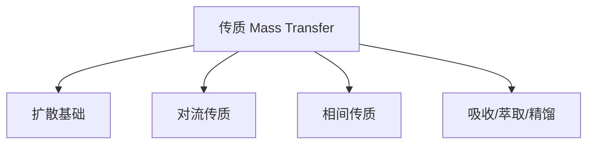

# CME222 传质 / Mass Transfer

> [!info] 课程概览
> - **学期**: 2026 Spring
> - **课程代码**: CME222
> - **核心主题**: 传质过程的基本原理与工程应用

---

## 课程地图

---

## 各周笔记

<!-- ingest-lecture skill 会按周 append 段落到这里 -->

## Week 1

第一讲是课程开门 + 传质概念铺垫：定义传质、列六种驱动力（浓度/温度/压力/重力/磁场/电场）、提出"扩散 vs 对流"两大模式、铺出扩散速率的 6 个影响因素，最后用动量+热+传质的三传类比把整门课的数学框架立起来。

- [[L01_intro_to_mass_transfer|L01 — 传质导论]]

**本周疑问**：
- 扩散系数 $D$ 在气/液/固三态里差 4–5 个数量级，怎么形成直觉？
- Fick 第一定律里 $C$ 用的是质量浓度、摩尔浓度还是摩尔分数？$D$ 单位会变吗？
- 三传类比中 $\tau$ 既是剪切应力又是动量通量 — 怎么理解这两种说法等价？

## Week 2

第二讲是把 L01 里"Fick 定律雏形"具体化：先把"组分多少"和"组分跑多快"两套语言学清楚（4 种浓度 + 3 种速度 + 它们的换算），然后正式给出 Fick 第一定律的 4 种等价形式，最后推出**总通量公式 $N_A = -cD\nabla y_A + y_A(N_A + N_B)$** — 区分扩散贡献和对流贡献。是后面所有扩散问题（等摩尔反向、单向、稳态、瞬态）的通用公式。

- [[L02_diffusive_mass_transfer|L02 — 扩散传质：浓度、速度、通量]]

**本周疑问**：
- 什么时候用 mass basis、什么时候用 molar basis？4 种 Fick 形式怎么选？
- 总通量公式里 $N_A$ 出现在等式两边怎么解？等摩尔反向扩散和单向扩散是不是为了消掉这个隐式项？
- Fick 第一定律的"等温等压"限制有多严苛？什么时候必须用 Stefan-Maxwell？

## Week 3

第三讲是把"$D$ 从哪里来"系统讲清楚。先讲 $D$ 的基本性质（维度、三态量级、$D_{AB}=D_{BA}$）+ 三态数据表（J.1/J.2/J.3）；然后从动力学理论推自扩散公式 → 加 Lennard-Jones 势引出 **Hirschfelder**（标准答案）→ 缺 LJ 参数时用 **Fuller** → 极性气体加 **Brokaw 修正** → 多组分用 **Wilke 调和平均**。形成完整的"何时用哪个公式"决策树。

- [[L03_diffusion_coefficient_estimation|L03 — 分子扩散系数与气体 D 的估算]]

**本周疑问**：
- Hirschfelder 单位制（cm²/s, atm, Å, g/mol）vs SI 实操怎么转？
- $\Omega_D$ 表/曲线在哪查最方便？精度多少？
- Brokaw 在"A 极性 + B 非极性"时退化成 Hirschfelder — 这真的合理吗？
- Wilke 调和平均的物理直觉（"扩散阻力并联"）？

## Week 4

第四讲把 L03 的"气相 D 估算"扩展到三个新场景：① **液相** — Stokes-Einstein（大分子）/ Wilke-Chang 系列经验式（小分子）/ Nernst（电解质，含 Hayduk-Laudie / Scheibel / Leffler-Cullinan / Tyn-Calus 一组配套公式）；② **固相** — vacancy + interstitial 两种机制 + Arrhenius 形式 $D = D_0 \exp(-Q/RT)$；③ **多孔介质** — Knudsen 数判断 + 混合扩散 + tortuous 修正 + hindered diffusion。本讲是"传质能开始用了"的转折点。

- [[L04_liquid_solid_pore_diffusivity|L04 — 液相、固相、多孔扩散系数估算]]

**本周疑问**：
- 液相 $D_{AB} \neq D_{BA}$ 怎么直觉理解？教材里给的 D 是哪个方向？
- Wilke-Chang 是 cgs 混合单位（cm²/s, cP, cm³/mol），实操怎么和 SI 协调？
- Stokes-Einstein 里的 $r$ 怎么取（范德华、水合、LJ）？
- 多孔的 $\varepsilon^2$ vs $\varepsilon/\tau$ 怎么选？$\tau$ 工业典型值多少？
- Hindered diffusion 的 $F_2$ 多项式（系数 -2.104, 2.09, -0.95）从哪来？

**本周疑问**：
- 扩散系数 $D$ 在气/液/固三态里差 4–5 个数量级，怎么形成直觉？
- Fick 第一定律里 $C$ 用的是质量浓度、摩尔浓度还是摩尔分数？$D$ 单位会变吗？
- 三传类比中 $\tau$ 既是剪切应力又是动量通量 — 怎么理解这两种说法等价？
