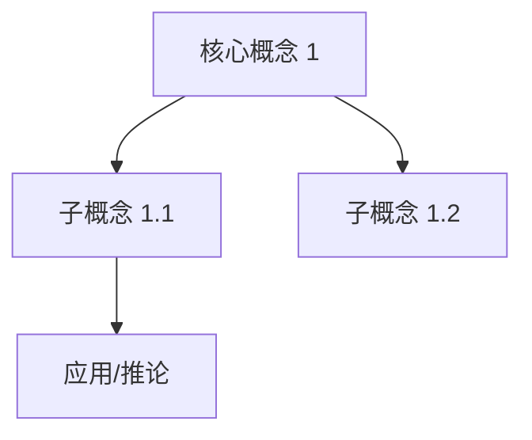

# {{TITLE_ZH}} / {{TITLE_EN}}

> [!abstract] 本节定位
> - **在课程中的位置**: 第 {{WEEK}} 周, L{{LECTURE_NUM}}
> - **前置知识**: [[]], [[]]
> - **本节核心**: (一句话)
> - **后续联系**: (将引向哪些后续内容)

---

## 知识结构

---

## 知识块 1 — {{BLOCK_TITLE}}

<!-- 术语规则：首次出现的专业术语，粒子笔记有则 [[链接]]，没有则就地用 1-2 句定义 -->

(AI 对该知识块的阐释,中文。整合多页 slide 的内容,按逻辑而非页码组织。)

$$公式$$

**解读**: (公式的一行中文解读)

> [!tip] 延伸（非 PPT 内容）
> (AI 认为相关但 PPT 未涉及的补充。只在确实有价值时添加,不强制。)

## 知识块 2 — ...

(继续按主题组织...)

---

## 对比与总结

| 对比维度 | 概念 A | 概念 B |
|---------|--------|--------|
| 定义 | ... | ... |
| 适用条件 | ... | ... |
| 关键区别 | ... | ... |

(仅在本讲涉及易混淆概念时使用,不强制。)

---

## 本节引入的核心概念

<!-- seed-concept skill populates this list automatically. -->

- [[]]
- [[]]

---

## 疑问 我的疑问

> [!question]
> 1. (具体、可操作的问题——能通过查资料或问老师回答的)
> 2. ...
> 3. ...

---

## 个人补充

> [!note] 我的理解
> (用户自己上课听到的、思考到的、和其他课联系起来的内容)

---

> [!info]- PPT 原文（Slides 1–N）
> **Slide 1**: (原文)
> **Slide 2**: (原文)
> ...
